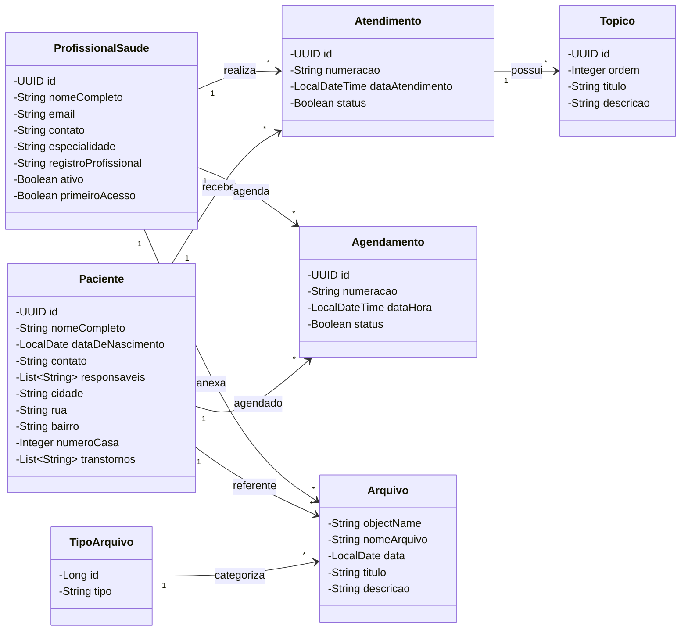
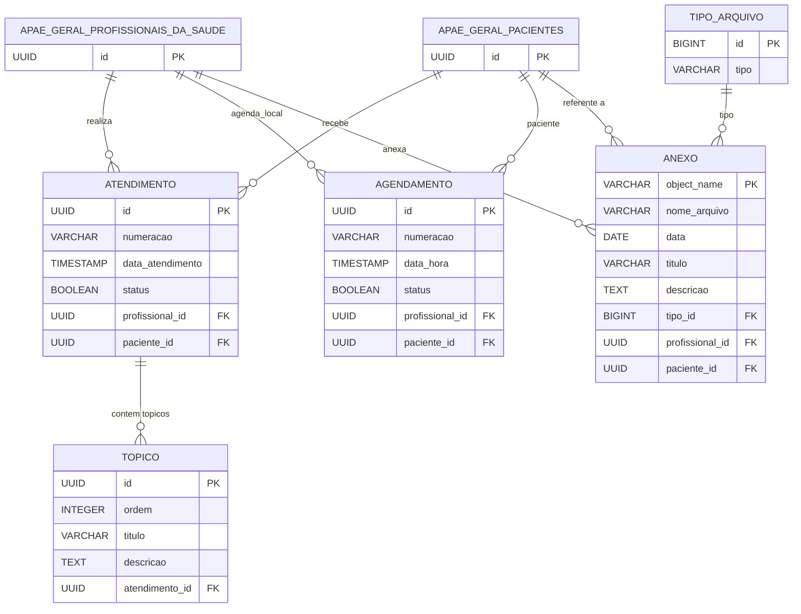

<div align="center">
  

  <h1>APAE Atendimento</h1>

  <p>
    <strong>Sistema completo para gestão de atendimentos e prontuários da APAE</strong>
  </p>

  <p>
    
    
    
    
    
    
    
    
  </p>

  <br />

  <a href="https://github.com/IFPBEsp/APAE-atendimento/commits/dev">
    
  </a>
  <a href="https://github.com/IFPBEsp/APAE-atendimento/issues">
    
  </a>
  <a href="https://github.com/IFPBEsp/APAE-atendimento/blob/dev/LICENSE">
    
  </a>
</div>

<br />

## Sumário

- [Sobre o Projeto](#-sobre-o-projeto)
- [Stack Tecnológica](#-stack-tecnológica)
- [Estrutura do Projeto](#-estrutura-do-projeto)
- [Quick Start](#-quick-start)
- [Infraestrutura e Deploy](#-infraestrutura-e-deploy)
- [Integração com o Banco Compartilhado (apae-geral)](#-integração-com-o-banco-compartilhado-apae-geral)
- [Diagrama de Classes](#-diagrama-de-classes)
- [Modelo Entidade-Relacionamento (ER)](#-modelo-entidade-relacionamento-er)
- [Referência da API](#-referência-da-api)
- [Códigos de Status HTTP](#-códigos-de-status-http)
- [Padrão de Documentação Swagger/OpenAPI](#-padrão-de-documentação-swaggeropenapi)
- [Git Flow](#-git-flow)
- [Style Guide](#-style-guide)
- [Conventional Commits](#-conventional-commits)
- [Como Contribuir](#-como-contribuir)

---

## Sobre o Projeto

A **APAE (Associação de Pais e Amigos dos Excepcionais)** é uma das maiores redes de atenção à pessoa com deficiência no Brasil. Este sistema foi desenvolvido para **otimizar o registro e o acompanhamento dos atendimentos clínicos e terapêuticos realizados pela APAE**, oferecendo uma plataforma segura, unificada e intuitiva para os profissionais de saúde da instituição.

O objetivo é **modernizar e unificar o processo de acompanhamento dos pacientes**, garantindo acesso rápido, organizado e restrito às informações clínicas — elevando a qualidade do atendimento multidisciplinar, agilizando a comunicação interna e fortalecendo a conformidade e privacidade no fluxo diário da APAE.

### Funcionalidades Principais

- **Gestão e Consulta de Pacientes** — visualização rápida da lista de pacientes atendidos com dados cadastrais, contatos e endereço.
- **Prontuário e Histórico de Consultas** — registro completo de cada sessão de atendimento, agrupado cronologicamente por mês e ano.
- **Tópicos de Evolução Clínica** — estrutura modular para acompanhamento do progresso, objetivos e intervenções do paciente.
- **Agenda Integrada** — visualização e marcação de horários de atendimento local com sincronização em tempo real da agenda canônica do Sistema Geral.
- **Gestão de Anexos e Laudos** — armazenamento em nuvem (S3/MinIO) de documentos, relatórios e arquivos anexados ao prontuário.
- **Privacidade e Vínculo por Especialidade** — cada profissional visualiza exclusivamente os pacientes sob sua responsabilidade, com vínculos derivados automaticamente da agenda compartilhada.
- **Perfil do Profissional & Primeiro Acesso** — alteração segura de credenciais de acesso inicial e consulta ao perfil de saúde.

---

## Stack Tecnológica

### Frontend

| Tecnologia | Versão | Descrição |
|------------|--------|-----------|
| [Next.js](https://nextjs.org/) | 15.x | Framework React com App Router e SSR |
| [React](https://react.dev/) | 19.x | Biblioteca para interfaces de usuário |
| [TypeScript](https://www.typescriptlang.org/) | 5.x | Superset JavaScript com tipagem estática |
| [Tailwind CSS](https://tailwindcss.com/) | 3.x | Framework de CSS utilitário |
| [shadcn/ui](https://ui.shadcn.com/) | — | Componentes de interface acessíveis baseados em Radix UI |
| [pnpm](https://pnpm.io/) | 10.x | Gerenciador de pacotes performático do monorepo |

### Backend

| Tecnologia | Versão | Descrição |
|------------|--------|-----------|
| [Spring Boot](https://spring.io/projects/spring-boot) | 3.4.x | Framework Java para APIs REST corporativas |
| [Java](https://adoptium.net/) | 21 | Linguagem de programação moderna (LTS) |
| [Spring Security](https://spring.io/projects/spring-security) | — | Autenticação stateless com JWT nativo e cookies HttpOnly |
| [Spring Data JPA](https://spring.io/projects/spring-data-jpa) | — | Camada de persistência e repositórios ORM |
| [Flyway](https://flywaydb.org/) | 11.x | Versionamento e migração automatizada do banco de dados (V1–V10) |
| [Springdoc OpenAPI](https://springdoc.org/) | 2.x | Especificação e documentação interativa (Swagger UI) |
| [AWS S3 SDK / MinIO](https://min.io/) | — | Armazenamento de arquivos binários e anexos |
| [Lombok](https://projectlombok.org/) | — | Redução de boilerplate Java via anotações |

### Infraestrutura e Deploy

| Tecnologia | Descrição |
|------------|-----------|
| [Docker](https://www.docker.com/) | Containerização da aplicação e serviços de suporte |
| [PostgreSQL](https://www.postgresql.org/) | Banco de dados relacional (PostgreSQL 16) |
| [MinIO](https://min.io/) | Object Storage compatível com AWS S3 para laudos e fotos |

### Ferramentas

| Tecnologia | Descrição |
|------------|-----------|
| [Git](https://git-scm.com/) | Controle de versão distribuído |
| [IntelliJ IDEA](https://www.jetbrains.com/idea/) / [VS Code](https://code.visualstudio.com/) | IDEs recomendadas |
| [Jest](https://jestjs.io/) | Testes unitários no frontend |

---

## Estrutura do Projeto

```
APAE-atendimento/
├── .env.example                          # Modelo de variáveis de ambiente
├── .github/
│   ├── ISSUE_TEMPLATE/                   # Templates padronizados para abertura de issues
│   ├── workflows/
│   │   └── ci.yml                        # Pipeline de Integração Contínua (GitHub Actions)
│   └── pull_request_template.md          # Template de Pull Request
├── .husky/                               # Git Hooks (pre-commit, commit-msg via commitlint)
├── .scripts/                             # Automação de setup e banco de dados local
│   ├── db/
│   │   └── apae-geral-contract.sql       # DDL do contrato mockado do schema apae_geral
│   ├── seed/
│   │   └── local-development.sql         # Carga de dados fictícios para desenvolvimento
│   ├── run-app.sh                        # Script de inicialização dos serviços
│   └── setup.sh                          # Script principal executado pelo pnpm db:prepare
├── backend/
│   ├── docker/                           # Configurações adicionais de container
│   │   ├── docker-compose.properties     # Configurações de ambiente local
│   │   └── local-secrets.properties.example
│   └── atendimento/                      # Backend — Spring Boot (Java 21)
│       ├── Dockerfile                    # Multi-stage build da imagem Docker do backend
│       ├── mvnw / mvnw.cmd               # Maven Wrapper (Linux/Windows)
│       ├── pom.xml                       # Gerenciamento de dependências Maven
│       └── src/
│           ├── main/
│           │   ├── java/br/org/apae/atendimento/
│           │   │   ├── AtendimentoApplication.java  # Ponto de entrada da aplicação Spring Boot
│           │   │   ├── config/           # Configurações de CORS, OpenAPI, S3/MinIO e Beans
│           │   │   ├── controllers/      # Endpoints REST e interfaces Swagger (*Docs.java)
│           │   │   ├── dtos/             # DTOs de Request e Response com Bean Validation
│           │   │   ├── entities/         # Entidades JPA mapeadas para o banco
│           │   │   ├── exceptions/       # Handlers globais e exceções personalizadas
│           │   │   ├── mappers/          # Conversão entre DTOs e Entidades
│           │   │   ├── repositories/     # Repositórios JPA e AgendamentoGeralReadRepository
│           │   │   ├── security/         # Filtros JWT, Token Blocklist e Contexto de Usuário
│           │   │   ├── services/         # Regras de negócio da aplicação
│           │   │   └── utils/            # Utilitários e helpers de uso geral
│           │   └── resources/
│           │       ├── application.properties
│           │       ├── application-dev.properties
│           │       ├── application-prod.properties
│           │       ├── application-test.properties
│           │       └── db/migration/     # Scripts de migração Flyway (V1–V10)
│           └── test/                     # Testes unitários e de integração (Testcontainers)
├── frontend/
│   └── atendimento-app/                  # Frontend — Next.js 15 (TypeScript + Tailwind)
│       ├── Dockerfile                    # Multi-stage build do frontend para produção
│       ├── next.config.ts                # Configurações do Next.js
│       ├── tsconfig.json                 # Configurações do compilador TypeScript
│       ├── components.json               # Configurações do shadcn/ui
│       ├── package.json                  # Dependências e scripts do frontend
│       └── src/
│           ├── app/                      # Rotas e páginas (App Router)
│           │   ├── (public)/             # Rotas abertas (login, autenticação)
│           │   └── (private)/            # Rotas autenticadas (dashboard, agenda, atendimento, relatórios)
│           ├── components/               # Componentes visuais compartilhados (shadcn/ui)
│           ├── features/                 # Módulos funcionais encapsulados por domínio
│           ├── lib/                      # Configurações de bibliotecas clientes
│           ├── services/                 # Clientes HTTP e integração com a API
│           ├── types/                    # Definições de tipos TypeScript
│           └── utils/                    # Funções utilitárias
├── docs/                                 # Documentação arquitetural e de banco de dados
│   ├── docs-database/
│   │   └── BANCO_DE_DADOS_COMPARTILHADO.md # Especificação completa do banco multi-schema
│   ├── diagrama_de_classes.puml          # Diagrama de Classes em formato PlantUML
│   ├── diagrama_de_classes.svg           # Exportação visual do diagrama de classes
│   └── modelo_banco_de_dados_main.svg    # Modelo conceitual do banco de dados
├── docker-compose.yaml                   # Orquestração do PostgreSQL, MinIO e ferramentas locais
├── package.json                          # Scripts do monorepo (pnpm workspaces)
└── commitlint.config.js                  # Padronização de mensagens de commit (Conventional Commits)
```

---

## Quick Start

### Desenvolvimento Local Autônomo

O produto **APAE Atendimento** foi projetado para ser executado de forma totalmente autônoma, dispensando a necessidade de iniciar os sistemas legados ou o Gestão Escolar.

O PostgreSQL local reproduz a estrutura multi-schema do banco em nuvem (Neon):

- `atendimento`: schema proprietário do produto, versionado pelas migrações Flyway (V1–V10);
- `apae_geral`: contrato mínimo mockado com usuários, profissionais, pacientes, cadastros anuais e agenda canônica;
- `gestao_escolar`: schema presente no banco compartilhado, mantido vazio neste ambiente.

Na raiz do repositório, execute:

```bash
cp .env.example .env
pnpm --dir frontend/atendimento-app install
pnpm db:prepare
pnpm dev
```

> **O que o `pnpm db:prepare` faz?**
> Ele automatiza a preparação completa da infraestrutura local executando na ordem exata:
> 1. Inicia os containers `postgres-db` e `minio` em background;
> 2. Executa o container `db-contract`, aplicando o script `.scripts/db/apae-geral-contract.sql` para criar os contratos mockados de `apae_geral`;
> 3. Executa o container `db-migrate`, aplicando as migrações Flyway (V1–V10) no schema `atendimento`;
> 4. Executa o container `db-seed`, populando o banco com dados fictícios idempotentes via `.scripts/seed/local-development.sql`.

### Serviços Locais

| Serviço | URL |
|---------|-----|
| **Frontend** | `http://localhost:3001` |
| **Backend API** | `http://localhost:8082/atendimento` (ou `8080/atendimento`) |
| **Swagger UI** | `http://localhost:8082/atendimento/swagger-ui.html` |
| **Health Check** | `http://localhost:8082/atendimento/actuator/health` |
| **PostgreSQL** | `localhost:5300` |
| **MinIO Console** | `http://localhost:9101` (API na porta `9100`) |

### Credenciais Fictícias de Desenvolvimento

| Papel / Perfil | Identificador / E-mail | Senha |
|----------------|------------------------|-------|
| **Profissional de Saúde** | `profissional@teste.local` | `12345678` |
| **MinIO Console (S3)** | `atendimento_minio` | `atendimento_minio_123` |

### Comandos Úteis do Monorepo

```bash
pnpm db:prepare    # Sobe banco/MinIO, aplica contratos, migrações Flyway e seed (recomendado)
pnpm db:contract   # Reaplica apenas os contratos mockados do apae_geral
pnpm db:migrate    # Aplica migrações Flyway pendentes do schema atendimento
pnpm db:seed       # Reaplica a carga de dados fictícios idempotentes
pnpm docker:down   # Para os containers Docker mantendo os volumes de dados
pnpm docker:drop   # Remove os containers e exclui todos os volumes locais
```

---

### Pré-requisitos

| Ferramenta | Versão Mínima | Finalidade |
|------------|---------------|------------|
| **Node.js** | 20+ | Execução do frontend Next.js e ferramentas do monorepo |
| **pnpm** | 9+ | Gerenciamento de dependências e execução de scripts |
| **Docker & Docker Compose** | 20+ | Subida dos containers PostgreSQL e MinIO locais |
| **Java JDK** | 21+ | Compilação e execução do backend Spring Boot |
| **Git** | — | Controle de versão do projeto |

### Passo a Passo de Execução Manual

#### 1. Clone o repositório

```bash
git clone https://github.com/IFPBEsp/APAE-atendimento.git
cd APAE-atendimento
```

#### 2. Configure as variáveis de ambiente

```bash
cp .env.example .env
```

> O backend Spring Boot lê o arquivo `.env` da raiz automaticamente via `spring.config.import`. Não é necessário duplicar credenciais em arquivos de propriedades.

#### 3. Prepare o banco de dados e a infraestrutura

```bash
pnpm db:prepare
```

> **Atenção:** Em um ambiente novo, nunca execute apenas `docker compose up postgres-db`. O backend falhará na inicialização se o contrato mockado do schema `apae_geral` e as migrações não tiverem sido previamente aplicados via `pnpm db:prepare`.

#### 4. Execute o backend

```bash
cd backend/atendimento

# Linux / macOS
./mvnw spring-boot:run -Dspring-boot.run.profiles=dev

# Windows
mvnw.cmd spring-boot:run -Dspring-boot.run.profiles=dev
```

A API estará acessível em `http://localhost:8082/atendimento` e a documentação interativa em `http://localhost:8082/atendimento/swagger-ui.html`.

#### 5. Execute o frontend

Em um novo terminal, a partir da raiz:

```bash
cd frontend/atendimento-app
pnpm install
pnpm dev
```

Acesse a interface web em `http://localhost:3001`.

#### 6. Execução via Docker Compose (Modo Produção)

Para validar a imagem de produção com todos os serviços integrados:

```bash
docker compose --profile PROD up -d --build
```

O frontend estará disponível em `http://localhost:80` (ou `3001`) e o backend em `http://localhost:8080/atendimento`.

#### 7. Build do Projeto (Opcional)

```bash
# Backend — gera o arquivo .jar em backend/atendimento/target/
cd backend/atendimento && ./mvnw clean package -DskipTests

# Frontend — gera o build de produção standalone
cd frontend/atendimento-app && pnpm build
```

---

## Infraestrutura e Deploy

### Ambiente de Desenvolvimento (Docker)

O arquivo `docker-compose.yaml` na raiz orquestra os serviços essenciais:

| Serviço | Imagem | Porta Exposta | Finalidade |
|---------|--------|---------------|------------|
| `postgres-db` | `postgres:16` | `5300:5432` | Banco de dados PostgreSQL multi-schema |
| `minio` | `minio/minio:latest` | `9100:9000`, `9101:9001` | Armazenamento de arquivos e console MinIO |
| `db-contract` | `postgres:16` *(profile: tools)* | — | Aplicação do contrato SQL do `apae_geral` |
| `db-migrate` | `flyway/flyway:11.7.2` *(profile: tools)* | — | Execução das migrações Flyway no schema `atendimento` |
| `db-seed` | `postgres:16` *(profile: tools)* | — | Inserção de dados fictícios para testes |

### Migrações de Banco de Dados

O Flyway versiona exclusivamente o schema `atendimento`. Os scripts em `backend/atendimento/src/main/resources/db/migration/` evoluem o modelo:

- `V1`: Criação inicial do schema, tabelas e catálogo básico;
- `V2`: Inserção dos tipos de arquivo padrão (`1 = Anexo`, `2 = Relatório`);
- `V5`: Ajuste de tipos temporais (`TIMESTAMP`) e status em atendimento;
- `V8`: Views globais de leitura de pacientes e profissionais;
- `V10`: Substituição da tabela de vínculo pela VIEW dinâmica `profissional_paciente`.

---

## Integração com o Banco Compartilhado (apae-geral)

Diferente de versões legadas do sistema, o **APAE Atendimento não realiza chamadas HTTP nem autenticação de API contra o APAE-Geral**. A integração ocorre diretamente na camada de banco de dados, através de uma **arquitetura de banco de dados compartilhado** (multi-schema).

### Arquitetura de Comunicação

```
┌────────────────────────────────────────────────────────┐
│                   PostgreSQL 16                        │
│                                                        │
│  ┌──────────────────┐            ┌──────────────────┐  │
│  │   apae_geral     │            │   atendimento    │  │
│  │ (schema canônico)│            │(schema de domínio│  │
│  │                  │            │                  │  │
│  │  • pacientes     │◀─── FKs ───│  • atendimento   │  │
│  │  • profissionais │◀─── FKs ───│  • topico        │  │
│  │  • agendamentos  │            │  • anexo         │  │
│  │  • cadastros     │            │  • agendamento   │  │
│  └─────────┬────────┘            └────────┬─────────┘  │
│            │                              │            │
│            │      VIEWs e JdbcTemplate    │            │
│            └──────────────────────────────┘            │
└────────────────────────────────────────────────────────┘
```

### Mecanismos de Integração

1. **Foreign Keys Cross-Schema**: Tabelas do Atendimento possuem chaves estrangeiras apontando diretamente para `apae_geral.pacientes` e `apae_geral.profissionais_da_saude`, garantindo integridade referencial com comportamento `NO ACTION`.
2. **Leitura Direta da Agenda (`AgendamentoGeralReadRepository`)**:
   - Os agendamentos recorrentes do Sistema Geral são lidos via `JdbcTemplate` com queries nativas otimizadas sobre `apae_geral.agendamentos`, `cadastros_anuais` e `pacientes`.
   - A expansão de recorrências utiliza `generate_series` do PostgreSQL, gerando identificadores determinísticos UUID por ocorrência e marcando a flag `externo: true`.
3. **Vínculo Derivado (`atendimento.profissional_paciente`)**:
   - A partir da migração `V10`, o vínculo entre profissional e paciente é calculado dinamicamente por uma **VIEW**.
   - O profissional visualiza e atende apenas pacientes que possuem agendamentos registrados no sistema.
4. **Views de Identidade e Catálogo**:
   - `vw_pacientes`: consolida dados de pacientes, endereços, responsáveis e transtornos sem duplicar registros;
   - `vw_profissional_saude`: provê os dados necessários para a autenticação e perfis dos especialistas de saúde.
5. **Redefinição de Senha e Primeiro Acesso**:
   - Executada através da função canônica do banco:
     ```sql
     SELECT apae_geral.definir_senha_primeiro_acesso(:usuarioId, :senhaHash);
     ```

### Contrato Local em Desenvolvimento

Para viabilizar o desenvolvimento desconectado, o script `.scripts/db/apae-geral-contract.sql` (executado pelo `pnpm db:prepare`) provisiona uma réplica do schema `apae_geral` contendo as tabelas, funções e views essenciais.

---

## Diagrama de Classes

O diagrama abaixo representa o domínio clínico do sistema de Atendimento e suas entidades principais:



---

## Modelo Entidade-Relacionamento (ER)

O modelo a seguir detalha o schema físico `atendimento` e suas relações com os objetos externos do `apae_geral`:



> **Nota:** A relação de vínculos `atendimento.profissional_paciente` é implementada como uma VIEW na migração `V10` e não possui chave primária física.

---

## Referência da API

Base URL: `http://localhost:8082/atendimento` (ou `http://localhost:8080/atendimento`)  
Swagger UI: `/swagger-ui.html`

### Autenticação (`/auth`)

| Método | Endpoint | Descrição |
|--------|----------|-----------|
| `POST` | `/auth/login` | Autentica o profissional e define o cookie HttpOnly |
| `POST` | `/auth/redefinir-senha` | Redefine a senha de primeiro acesso do profissional |
| `POST` | `/auth/logout` | Realiza logout e revoga o token no blocklist |
| `GET` | `/auth/me` | Verifica o estado da sessão autenticada |

### Pacientes (`/pacientes`)

| Método | Endpoint | Descrição |
|--------|----------|-----------|
| `GET` | `/pacientes/{id}` | Busca os dados completos do paciente por ID |
| `GET` | `/pacientes/{id}/nome-completo` | Retorna apenas o nome completo do paciente |
| `GET` | `/pacientes/search` | Busca paginada de pacientes vinculados com filtros (nome, CPF, cidade) |
| `GET` | `/pacientes/dropdown` | Lista simplificada de pacientes vinculados para preenchimento de selects |
| `POST` | `/pacientes/{pacienteId}` | Realiza upload da foto de perfil do paciente (Multipart) |

### Atendimentos (`/atendimentos`)

| Método | Endpoint | Descrição |
|--------|----------|-----------|
| `POST` | `/atendimentos` | Registra um novo atendimento clínico |
| `GET` | `/atendimentos/{pacienteId}` | Lista atendimentos do paciente agrupados por mês e ano (paginado) |
| `PUT` | `/atendimentos/{atendimentoId}` | Atualiza tópicos e anotações do atendimento |
| `PATCH` | `/atendimentos/{atendimentoId}/concluir` | Marca o atendimento como concluído |
| `DELETE` | `/atendimentos/{pacienteId}/{atendimentoId}` | Remove um atendimento registrado |

### Agenda (`/agendamento`)

| Método | Endpoint | Descrição |
|--------|----------|-----------|
| `POST` | `/agendamento` | Cria um agendamento na agenda local |
| `GET` | `/agendamento` | Lista a agenda unificada do profissional (locais + canônicos do Geral) agrupada por dia |
| `PUT` | `/agendamento/{agendamentoId}` | Edita data e horário de um agendamento local |
| `PATCH` | `/agendamento/{pacienteId}/{agendamentoId}/concluir` | Marca o agendamento como realizado |
| `DELETE` | `/agendamento/{pacienteId}/{agendamentoId}` | Remove um agendamento da agenda local |

### Arquivos e Anexos (`/arquivo`)

| Método | Endpoint | Descrição |
|--------|----------|-----------|
| `POST` | `/arquivo` | Upload de arquivo/laudo no storage MinIO com metadados JSON |
| `GET` | `/arquivo/{pacienteId}/{tipoId}` | Lista anexos do paciente filtrados pelo tipo de arquivo |
| `GET` | `/arquivo/date/{pacienteId}/{tipoId}/{data}` | Busca anexos por paciente, tipo e data específica |
| `DELETE` | `/arquivo/delete?objectName=` | Exclui o arquivo do MinIO e seu registro correspondente |

### Profissionais de Saúde (`/profissionais`)

| Método | Endpoint | Descrição |
|--------|----------|-----------|
| `GET` | `/profissionais` | Retorna o perfil completo do profissional autenticado |
| `GET` | `/profissionais/pacientes` | Lista todos os pacientes vinculados ao profissional |
| `GET` | `/profissionais/pacientes-option` | Retorna opções formatadas de pacientes para dropdowns |

---

## Códigos de Status HTTP

O backend segue estritamente a convenção REST:

| Código | Significado | Quando é Utilizado |
|--------|-------------|-------------------|
| `200 OK` | Sucesso na requisição | Operações de consulta (`GET`), edição (`PUT`) e atualizações parciais (`PATCH`) |
| `201 Created` | Recurso criado | Criação de agendamentos, atendimentos e uploads de arquivos |
| `204 No Content` | Sem conteúdo de retorno | Remoção bem-sucedida de arquivos (`DELETE`) |
| `400 Bad Request` | Requisição inválida | Erros de validação nos payloads (`@Valid`), regras de negócio violadas ou metadados incorretos |
| `401 Unauthorized` | Não autenticado | Sessão inexistente, expirada ou token JWT ausente/revogado |
| `403 Forbidden` | Proibido / Sem permissão | Tentativa de acesso a pacientes ou dados que não pertencem ao profissional |
| `404 Not Found` | Não encontrado | Identificador inexistente de paciente, atendimento ou arquivo |
| `409 Conflict` | Conflito de dados | Violação de unicidade ou duplicidade de registros |
| `500 Internal Server Error` | Erro interno | Exceções não tratadas na infraestrutura ou storage |

---

## Padrão de Documentação Swagger/OpenAPI

Para manter o código limpo e desacoplar anotações descritivas da implementação das regras de negócio, o Atendimento adota o padrão de **Interfaces de Documentação (`*Docs.java`)**.

### Como Funciona

1. **Interface de Contrato**: Cada controller possui uma interface correspondente (ex: `AtendimentoControllerDocs`, `PacienteControllerDocs`).
2. **Anotações OpenAPI**: Anotações `@Tag`, `@Operation`, `@ApiResponses`, `@ApiResponse` e `@Parameter` são declaradas exclusivamente na interface.
3. **Implementação Limpa**: A classe `@RestController` implementa a interface sem precisar repetir blocos verbosos de documentação.

### Exemplo

```java
// Interface de Documentação
@Tag(name = "Atendimento", description = "Endpoints de registro e consulta de atendimentos")
public interface AtendimentoControllerDocs {

    @Operation(summary = "Criar atendimento", description = "Registra um novo atendimento com seus tópicos.")
    @ApiResponses({
        @ApiResponse(responseCode = "201", description = "Atendimento criado com sucesso"),
        @ApiResponse(responseCode = "400", description = "Dados inválidos fornecidos"),
        @ApiResponse(responseCode = "401", description = "Não autorizado")
    })
    ResponseEntity<AtendimentoResponseDTO> criarAtendimento(
        AtendimentoRequestDTO atendimento,
        @Parameter(hidden = true) UsuarioAutenticado usuarioAutenticado
    );
}

// Controller Implementador
@RestController
@RequestMapping("/atendimentos")
public class AtendimentoController implements AtendimentoControllerDocs {

    @Override
    @PostMapping
    public ResponseEntity<AtendimentoResponseDTO> criarAtendimento(
            @Valid @RequestBody AtendimentoRequestDTO dto,
            @AuthenticationPrincipal UsuarioAutenticado usuario) {
        return ResponseEntity.status(HttpStatus.CREATED).body(service.addAtendimento(dto, usuario.getId()));
    }
}
```

---

## Git Flow

O projeto adota o modelo de branches simplificado, com a branch `dev` como principal e protegida:

```
dev ────────────────────────────────────────────────────────▶ (branch principal protegida)
  │
  ├── 404-chore-padronizar-readme ───────────── PR ── review ── merge em dev
  ├── 411-refactor-remover-fluxo-homepage ──── PR ── review ── merge em dev
  └── 420-feat-novos-topicos-atendimento ───── PR ── review ── merge em dev
```

### Convenção de Branches

| Padrão de Nomenclatura | Finalidade |
|------------------------|------------|
| `dev` | Branch principal e base de integração estável |
| `{numero}-feat-*` | Desenvolvimento de novas funcionalidades |
| `{numero}-fix-*` | Correção de bugs e regressões |
| `{numero}-chore-*` | Manutenção, dependências e configurações |
| `{numero}-docs-*` | Criação ou revisão de documentação |
| `{numero}-refactor-*` | Refatoração de código sem alteração funcional |

---

## Style Guide

### Diretrizes Gerais

- **Nomenclatura no Código**: Nomes de variáveis, métodos, classes e arquivos sempre em **inglês**.
- **Comentários e Documentação**: Textos de interface, mensagens de erro, commits e documentações em **português**.
- **Indentação**: 2 espaços no Frontend (TypeScript/React); 4 espaços no Backend (Java).

### Frontend (TypeScript / React)

- Componentes e tipos nomeados em **PascalCase** (`PacienteCard.tsx`, `AtendimentoResponseDTO`).
- Hooks e funções utilitárias em **camelCase** (`useAtendimento`, `formatCpf`).
- Estilização unificada via classes utilitárias do **Tailwind CSS**.
- Componentes modulares agrupados por domínio em `src/features/`.

### Backend (Java / Spring Boot)

- Classes nomeadas em **PascalCase** (`AtendimentoService`, `AgendamentoController`).
- Métodos e variáveis em **camelCase** (`buscarPorId`, `dataAtendimento`).
- Constantes em **UPPER_SNAKE_CASE** (`TOKEN_COOKIE_NAME`).
- DTOs estritamente separados das entidades de banco, com validações via Bean Validation (`@NotNull`, `@NotBlank`).

---

## Conventional Commits

Mensagens de commit devem seguir o padrão:

```
tipo: descrição curta em português e letras minúsculas
```

| Tipo | Finalidade | Exemplo |
|------|------------|---------|
| `feat` | Nova funcionalidade | `feat: adiciona upload de laudo no formato pdf` |
| `fix` | Correção de defeito | `fix: corrige ordenação de agendamentos por horário` |
| `docs` | Alteração de documentação | `docs: padroniza readme com modelo do gestao escolar` |
| `refactor` | Refatoração sem impacto funcional | `refactor: desacopla documentacao swagger em interfaces docs` |
| `chore` | Manutenções e dependências | `chore: atualiza imagem do flyway no docker-compose` |
| `test` | Criação ou ajuste de testes | `test: adiciona teste de integracao para agendamento read` |

---

## Como Contribuir

1. Localize a issue atribuída a você no board do projeto;
2. Crie uma branch a partir da `dev` seguindo o formato `{numero}-{tipo}-{descricao}`;
3. Desenvolva as alterações mantendo cobertura de testes e conformidade com o Style Guide;
4. Realize os commits seguindo a convenção do [Conventional Commits](#-conventional-commits);
5. Abra um **Pull Request** para a branch `dev`, preencha o template e mencione o PO e o Scrum Master para Code Review;
6. Após as aprovações técnicas e resolução de eventuais comentários, o merge será realizado.

---

<div align="center">
  <sub>Desenvolvido com dedicação para a comunidade APAE</sub>
</div>
