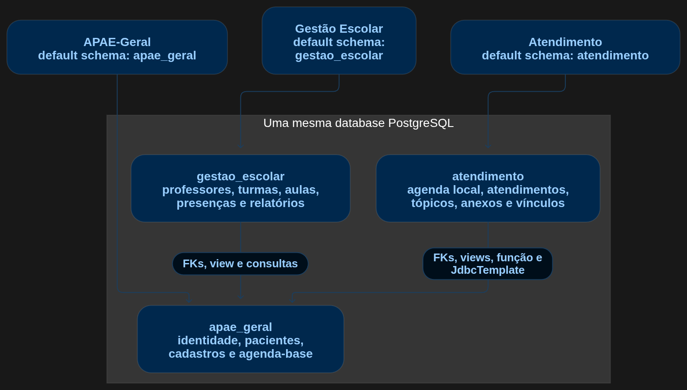
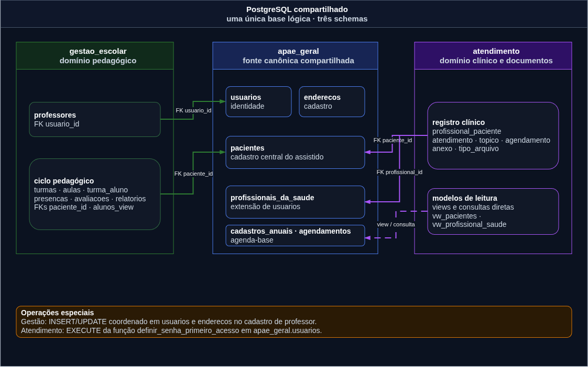
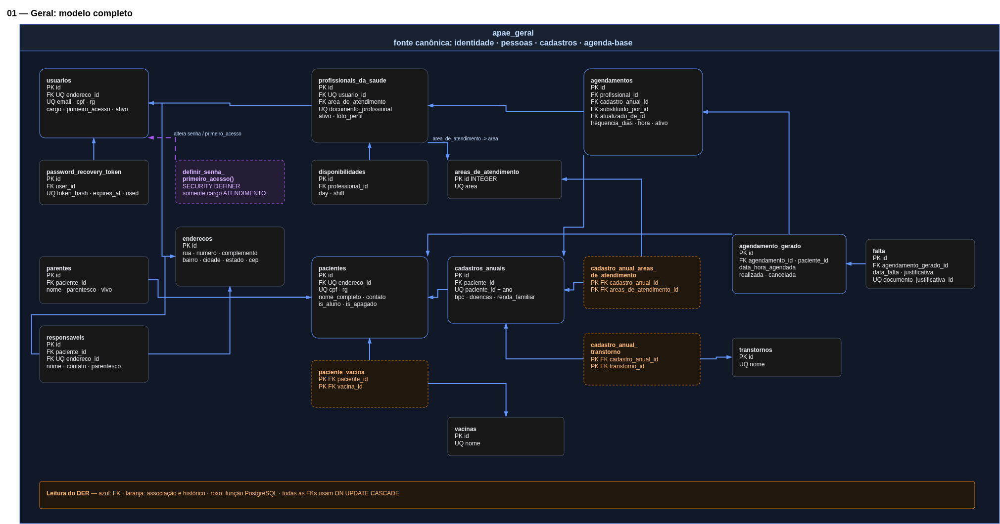
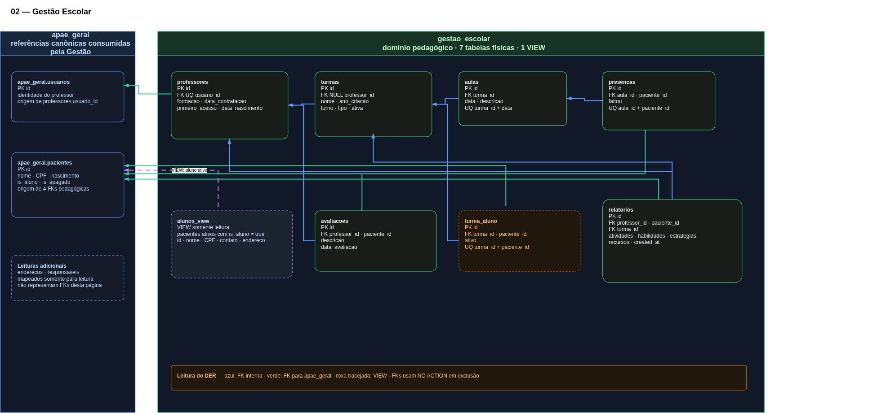
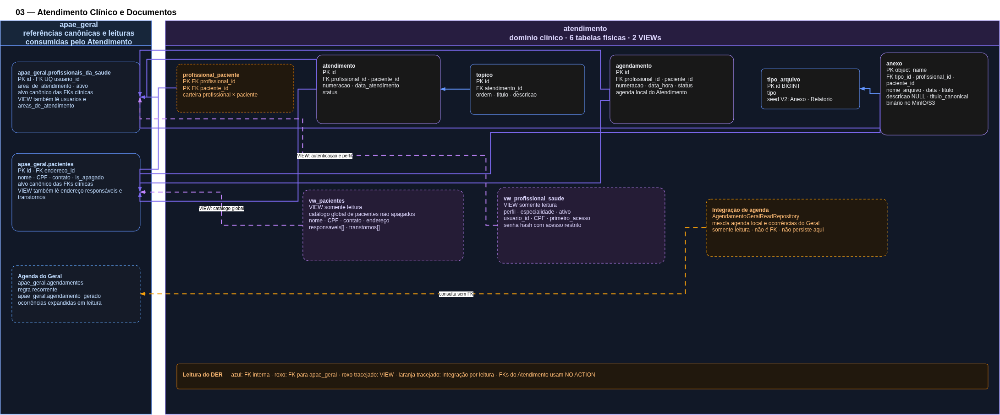

# Banco de dados compartilhado dos serviços APAE

> Documento de referência técnica para os repositórios **APAE**, **APAE-gestao-escolar** e **APAE-atendimento**. Ele descreve o estado versionado nas migrations e no código-fonte atual; não é uma leitura direta de uma instância de produção. O levantamento usou os commits `APAE d4bd847`, `Gestão Escolar af66362` e `Atendimento 544ec9d`.

## Em uma frase

O sistema foi desenhado para usar **uma mesma base lógica PostgreSQL**, dividida em três schemas: `apae_geral`, `gestao_escolar` e `atendimento`. Cada serviço é dono das migrations do seu schema, mas pode acessar objetos de outro schema por nomes qualificados, views e chaves estrangeiras cross-schema.

Essa decisão elimina cópias e sincronizações assíncronas para os dados compartilhados: quando todos os serviços apontam para a mesma base, uma alteração confirmada em um schema já fica visível nas consultas dos demais.

Durante o desenvolvimento pré-produção, essa topologia é simulada por bancos de dados locais independentes. É uma decisão operacional temporária para permitir que os três grupos trabalhem de forma autônoma; a topologia pretendida de produção continua sendo uma única database com os três schemas reais.

## Como ler este documento

- **Banco compartilhado** significa a mesma *database* PostgreSQL, não apenas o mesmo servidor ou cluster. O PostgreSQL permite `schema.tabela` somente dentro da mesma database.
- **Dono** é o serviço responsável por evoluir um objeto via Flyway. Consumir uma tabela não autoriza alterar sua estrutura.
- **Contrato** é a parte de um schema da qual outro serviço depende: colunas, tipos, chaves, views, funções e regras semânticas.
- Nos perfis normais de desenvolvimento/produção, os três backends usam Spring Boot, JPA/Hibernate e Flyway com `ddl-auto=none`. A exceção é o perfil de teste do Atendimento, que usa `validate` para conferir o mapeamento sem gerar DDL. Em todos os casos, **as migrations são a fonte de verdade do DDL**.
- Campos, constraints e objetos abaixo representam o resultado final de migrations executadas do zero. O banco pode ter ainda tabelas operacionais do Flyway, como `<schema>.flyway_schema_history`.

## Visão da arquitetura

O `apae_geral` é o núcleo compartilhado. Os schemas de Gestão Escolar e Atendimento mantêm seus próprios domínios e referenciam identificadores canônicos do Geral. No código atual:

- Gestão Escolar não consulta `atendimento`.
- Atendimento não consulta `gestao_escolar`.
- APAE-Geral não consulta os dois schemas de produto.

Isso é uma topologia em estrela, e não uma malha em que todos os serviços leem e escrevem todos os schemas.

## Diagramas DER de referência

Os diagramas abaixo são a representação visual do estado final documentado pelas migrations. Eles privilegiam chaves, relações e limites de propriedade; para os tipos completos, regras e histórico de cada objeto, use os catálogos das seções seguintes.

### Página 00 — Visão compartilhada

Esta página apresenta a fronteira mais importante: uma única *database* PostgreSQL com três schemas. Verde identifica Gestão Escolar, azul identifica o núcleo `apae_geral` e roxo identifica Atendimento. As setas entre schemas representam FKs ou leituras diretas, e não chamadas entre APIs.

### Página 01 — `apae_geral`

O DER do Geral mostra a fonte canônica de identidade, pessoas, cadastros anuais e agenda-base. As caixas tracejadas em laranja são tabelas associativas ou de histórico; a caixa roxa destaca a função PostgreSQL usada pelo Atendimento no primeiro acesso.

### Página 02 — `gestao_escolar`

O esquema pedagógico fica à direita, enquanto as referências canônicas do Geral ficam isoladas à esquerda. As linhas verdes representam dependências cross-schema e a linha roxa tracejada representa a view `alunos_view`.

### Página 03 — `atendimento`

O esquema clínico separa as tabelas próprias das referências em `apae_geral`. Linhas roxas são FKs cross-schema, azul indica FK interna, tracejado roxo identifica views e tracejado laranja identifica a consulta de agenda que não cria FK nem persiste dados no schema de Atendimento.

> Manutenção dos diagramas: use o arquivo do draw.io como fonte de edição e exporte novamente o PNG com o mesmo nome após qualquer alteração. Os PNGs atuais incorporam dados do draw.io, mas uma fonte `.drawio` correspondente deve ser salva junto à alteração para facilitar revisão e edição futura.

## O que schemas resolvem — e o que não resolvem

Schemas organizam namespace, propriedade de migrations e permissões. Eles permitem escrever, por exemplo:

~~~sql
SELECT p.nome_completo
FROM apae_geral.pacientes AS p;
~~~

ou declarar uma FK entre domínios:

~~~sql
FOREIGN KEY (paciente_id)
  REFERENCES apae_geral.pacientes(id)
~~~

Eles **não** criam replicação, API, fila, cache compartilhado ou transação distribuída. Uma view PostgreSQL normal consulta as tabelas de origem no momento da leitura; ela não materializa nem duplica dados.

Também não são, por si só, uma fronteira de segurança. A separação efetiva depende de usuários/roles distintos, `USAGE` no schema e privilégios específicos para tabelas, views e funções.

## Consistência e “tempo real”

### Visibilidade dos dados

As integrações atuais usam tabelas, views e SQL nativo no mesmo PostgreSQL. Sob o isolamento padrão `READ COMMITTED`, cada comando enxerga os dados confirmados mais recentes no instante em que ele começa. Logo, após um `COMMIT` no Geral, uma nova consulta da Gestão ou do Atendimento já pode enxergar o resultado — sem job de sincronização.

Views como `gestao_escolar.alunos_view` e `atendimento.vw_pacientes` são views comuns, não materializadas. Por isso refletem as tabelas de `apae_geral` a cada consulta.

### Quando uma operação é atômica

Uma operação é uma única transação ACID quando todos os seus comandos usam a **mesma database**, a conexão vinculada pelo mesmo `PlatformTransactionManager` e o mesmo contexto `@Transactional`:

~~~sql
BEGIN;
INSERT INTO apae_geral.enderecos (...);
INSERT INTO apae_geral.usuarios (...);
INSERT INTO gestao_escolar.professores (...);
COMMIT;
~~~

O fluxo de criação de professor da Gestão Escolar funciona exatamente nessa lógica: endereço e usuário são gravados no Geral e a extensão `professores` é gravada no schema escolar dentro de uma transação Spring única.

O fato de duas requisições atravessarem APIs diferentes não cria uma transação compartilhada automaticamente. Se dois serviços abrirem conexões separadas e cada um fizer seu próprio `COMMIT`, haverá duas transações independentes; para isso ser atômico seria necessário um protocolo explícito de coordenação, que não existe na implementação atual.

### Integridade estrutural

As FKs cross-schema impedem que um registro escolar ou de atendimento aponte para um paciente/profissional inexistente. Elas também tendem a bloquear exclusões físicas de objetos centrais ainda referenciados, pois as FKs atuais não declaram `ON DELETE CASCADE`.

## Responsabilidades por schema

| Serviço / schema | Dono das migrations | Dados próprios | Dependências externas atuais |
|---|---|---|---|
| APAE-Geral / `apae_geral` | Repositório `APAE`, V1–V11 | usuários, endereços, profissionais de saúde, pacientes, cadastros anuais, agenda-base, faltas e dados de apoio | Não há leitura produtiva de `gestao_escolar` ou `atendimento` |
| Gestão Escolar / `gestao_escolar` | Repositório `APAE-gestao-escolar`, V1–V6 | professores, turmas, aulas, matrículas, presenças, avaliações, relatórios e a view de alunos | `apae_geral.usuarios`, `enderecos`, `pacientes` e `responsaveis` |
| Atendimento / `atendimento` | Repositório `APAE-atendimento`, V1–V9 | vínculo profissional–paciente, agenda local, atendimentos, tópicos, anexos, tipos de arquivo e views de leitura | objetos de identidade, pacientes, cadastros, agenda-base e função de primeiro acesso em `apae_geral` |

### Fonte canônica e exceções de escrita

O Geral é a fonte canônica para identidade, endereço, paciente e profissional de saúde. Há uma exceção funcional explícita: a Gestão Escolar cria e atualiza `apae_geral.usuarios` e `apae_geral.enderecos` para cadastrar professores. Por isso, alterações nessas duas tabelas exigem coordenação entre os dois times.

O Atendimento normalmente persiste apenas objetos de `atendimento`. A redefinição de senha de um profissional de atendimento é a exceção: ele chama `apae_geral.definir_senha_primeiro_acesso(uuid, text)`, que altera `apae_geral.usuarios`.

## Configuração técnica nos três backends

| Repositório | Datasource e schema Hibernate | Flyway | PostgreSQL local (desenvolvimento) |
|---|---|---|---|
| `APAE` | `DB_URL`, `DB_USERNAME` e `DB_PASSWORD`; `default_schema=apae_geral` | `schemas/default-schema=apae_geral`; migrations V1–V11 | PostgreSQL 15, database `apae`, porta 5200 |
| `APAE-gestao-escolar` | `DATASOURCE_URL`, `DATASOURCE_USERNAME` e `DATASOURCE_PASSWORD`; `default_schema=gestao_escolar` | `schemas/default-schema=gestao_escolar`; migrations V1–V6 | PostgreSQL 15, database `gestao_escolar_local`, porta 5400 |
| `APAE-atendimento` | `DB_URL`, `DB_USER` e `DB_PASSWORD`; `default_schema=atendimento` | `schemas/default-schema=atendimento`; migrations V1–V9 | PostgreSQL 16, database `atendimento_local`, porta 5300 |

Os arquivos de configuração são:

- [APAE-Geral: `application.yaml`](../../apps/api/src/main/resources/application.yaml) e [`docker-compose.yml`](../../docker-compose.yml)
- [Gestão Escolar: `application.properties`](https://github.com/IFPBEsp/APAE-gestao-escolar/blob/af6636238fb47164f491c2749ee15ce217a4adf2/api/src/main/resources/application.properties) e [`api/docker-compose.yml`](https://github.com/IFPBEsp/APAE-gestao-escolar/blob/af6636238fb47164f491c2749ee15ce217a4adf2/api/docker-compose.yml)
- [Atendimento: `application.properties`](https://github.com/IFPBEsp/APAE-atendimento/blob/544ec9d5e17b8fa8df7a42d556d8023e223e4d88/backend/atendimento/src/main/resources/application.properties), [`application-dev.properties`](https://github.com/IFPBEsp/APAE-atendimento/blob/544ec9d5e17b8fa8df7a42d556d8023e223e4d88/backend/atendimento/src/main/resources/application-dev.properties), [`application-prod.properties`](https://github.com/IFPBEsp/APAE-atendimento/blob/544ec9d5e17b8fa8df7a42d556d8023e223e4d88/backend/atendimento/src/main/resources/application-prod.properties), [`application-test.properties`](https://github.com/IFPBEsp/APAE-atendimento/blob/544ec9d5e17b8fa8df7a42d556d8023e223e4d88/backend/atendimento/src/main/resources/application-test.properties) e [`docker-compose.yaml`](https://github.com/IFPBEsp/APAE-atendimento/blob/544ec9d5e17b8fa8df7a42d556d8023e223e4d88/docker-compose.yaml)

`hibernate.default_schema` orienta o ORM; `spring.flyway.default-schema` orienta o Flyway e sua tabela de histórico. Eles não equivalem a um `SET search_path` universal para SQL nativo/JdbcTemplate. Consultas nativas de integração devem qualificar o schema — por exemplo, `apae_geral.tabela` — ou configurar explicitamente o `search_path`.

Os bancos de dados, portas e contratos dessa tabela descrevem somente o modo local de desenvolvimento de cada repositório; não representam a topologia alvo de produção.

## Runbook de deploy da database compartilhada

Esta seção descreve o procedimento alvo para homologação integrada e produção. Ela é deliberadamente neutra quanto ao provedor de nuvem, VM ou orquestrador, mas é específica sobre a ordem e os gates que não podem ser ignorados.

> **Estado atual x alvo de produção.** Os três backends habilitam Flyway na inicialização e, hoje, compartilham a mesma role entre aplicação e migrador. Não existe um pipeline global, um compose integrado ou uma tabela Flyway única que imponha a ordem entre os três schemas. Os `docker-compose` e os comandos `db:prepare` dos repositórios são ferramentas de desenvolvimento local: eles sobem bancos próprios, contratos mockados e seeds. Em especial, o compose de Atendimento depende de `db-contract` e de um PostgreSQL local; ele não deve ser usado como deploy da database compartilhada sem uma adaptação explícita. O runbook abaixo fecha essa lacuna operacional.

### 1. Definir o artefato de release e a janela de mudança

Antes de abrir uma janela de deploy, registre em um ticket ou release note:

- commit/tag e imagem exatos de cada um dos três serviços;
- conjunto de migrations esperado: Geral V1–V11, Gestão V1–V6 e Atendimento V1–V9;
- URL JDBC **sem senha** e nome da única database alvo;
- responsável pelo banco, responsável por executar as migrations e responsável por aprovar o smoke test;
- confirmação de que a mudança foi executada antes em uma homologação com os três schemas reais, não apenas contra os mocks locais;
- classificação da migration: aditiva/compatível, migração de dados ou potencialmente incompatível.

Uma mudança de contrato compartilhado deve seguir o padrão *expand/contract*: primeiro adicionar uma interface compatível no dono (`apae_geral`), depois liberar consumidores compatíveis, migrar dados quando necessário e só remover a interface antiga em uma release posterior. Não edite uma migration já aplicada; crie sempre uma nova migration no repositório proprietário do objeto.

### 2. Pré-flight: confirmar destino, backup e pré-requisitos

Execute estes passos **antes** de qualquer `migrate`:

1. Confirme que as três credenciais apontam para a mesma database. Para cada role, execute `SELECT current_database(), current_user, current_setting('search_path');`; o valor de `current_database()` deve ser idêntico.
2. Faça backup lógico da **database completa**, não de schemas isolados. Há FKs cross-schema; restaurar somente um schema pode deixar o conjunto inconsistente. Use o mecanismo de backup aprovado pelo ambiente e valide ao menos a listagem/recuperação em um destino seguro.
3. Verifique espaço, conexões, TLS/rede, segredos e a versão de PostgreSQL aprovada para os três serviços. A versão deve ser testada em homologação, pois os ambientes locais atuais usam PostgreSQL 15 e 16.
4. Verifique `pgcrypto` antes de chegar à V6 do Geral:

~~~sql
SELECT extname
FROM pg_extension
WHERE extname = 'pgcrypto';

SELECT to_regprocedure('gen_random_uuid()');
~~~

5. Confirme que não há migration anterior com falha e capture o estado atual dos três históricos Flyway. Uma falha deve ser investigada antes de usar `repair`; nunca use `clean` em ambiente integrado ou produção.

O Geral só passa a usar `gen_random_uuid()` na V6, mas a extensão é uma dependência da database. As V1 de Gestão e Atendimento tentam criá-la de modo idempotente; isso não substitui um bootstrap explícito pelo DBA, porque a role de aplicação pode não possuir `CREATE` na database.

### 3. Bootstrap da database e dos schemas

O DBA ou o papel administrativo deve executar uma vez, de forma auditável:

1. criar a database PostgreSQL compartilhada;
2. instalar `pgcrypto` na database;
3. criar as roles de migrador e runtime, ou registrar formalmente a decisão temporária de usar a mesma role;
4. criar/atribuir os donos de `apae_geral`, `gestao_escolar` e `atendimento`, conforme a política do ambiente;
5. conceder os privilégios cross-schema descritos na próxima seção;
6. guardar as credenciais em um cofre de segredos — nunca em `.env`, `local-secrets.properties`, logs de CI ou imagens.

O script global de roles/grants ainda não existe no código versionado. Portanto, este bootstrap é uma responsabilidade explícita de operação e deve ser revisado junto com cada alteração que introduza uma nova dependência cross-schema.

### 4. Permissões mínimas para a topologia compartilhada

As migrations não constituem, hoje, um modelo completo de roles para produção. A Gestão possui migrations que tentam conceder `SELECT, INSERT, UPDATE` em `apae_geral.usuarios` e `apae_geral.enderecos` ao `current_user`; o Atendimento não possui migration de `GRANT` equivalente.

Hoje, Flyway e API usam a mesma role por padrão: nenhum dos três backends configura `spring.flyway.user/password` separado do datasource e Flyway fica habilitado na aplicação. A separação entre role de migrador e role de runtime é uma recomendação de operação futura, não algo já implementado. Para adotá-la, é preciso configurar credenciais Flyway próprias, executar um migrador externo/desabilitar Flyway na API de runtime, ou aceitar privilégios de DDL na role da API; o migrador também precisa de acesso ao `flyway_schema_history`.

Há dois modos possíveis de operar a primeira produção:

| Modo | Como funciona | Risco/decisão operacional |
|---|---|---|
| **Recomendado** | Jobs one-shot de Flyway, executados antes das APIs, usam roles de migrador. As APIs recebem `SPRING_FLYWAY_ENABLED=false` e usam roles de runtime com privilégios mínimos. | Evita DDL na role da API, impede corrida entre réplicas e gera uma etapa auditável. Exige provisionar jobs e credenciais separadas. |
| **Temporário, igual ao código atual** | Cada API executa Flyway no startup com a mesma role do datasource. | A implantação deve subir uma instância por vez na ordem deste runbook; nenhuma réplica adicional pode iniciar antes de o Flyway terminar. A role de runtime continuará com privilégios de DDL. |

O primeiro modo deve ser adotado antes de escalar réplicas ou automatizar releases. Os locks de `apae_geral.flyway_schema_history`, `gestao_escolar.flyway_schema_history` e `atendimento.flyway_schema_history` são independentes: eles não serializam migrations de schemas diferentes.

Como regra de provisionamento, o DBA deve conceder apenas o necessário:

| Papel | Necessidades no `apae_geral` |
|---|---|
| Migrador da Gestão Escolar | `USAGE`; `REFERENCES` em `usuarios` e `pacientes` antes da V1; `SELECT` nas tabelas usadas pela view e pelas consultas. |
| API da Gestão Escolar | `USAGE`; `SELECT` em pacientes/responsáveis/usuários/endereço; `INSERT, UPDATE` em usuários e endereços para os fluxos autorizados. |
| Migrador do Atendimento | `USAGE`; `REFERENCES` em `usuarios` (necessário à V1 histórica), `profissionais_da_saude` e `pacientes`; `SELECT` em todas as tabelas que alimentam as views. |
| API do Atendimento | `USAGE`; `SELECT` nas suas views; `SELECT` direto em `agendamentos`, `cadastros_anuais` e `pacientes` para `JdbcTemplate`; `EXECUTE` na função de primeiro acesso quando esse fluxo estiver habilitado. |
| Role do APAE-Geral | Controle de suas tabelas e do contrato, sem precisar de acesso produtivo aos schemas dos produtos no código atual. |

Uma view PostgreSQL comum usa, por padrão, as permissões do seu dono sobre as tabelas-base. Assim, uma API de Atendimento separada pode receber `SELECT` apenas nas suas views, sem `SELECT` amplo em todas as tabelas-base, desde que o dono da view esteja corretamente autorizado. A função de primeiro acesso usa `SECURITY DEFINER` e revoga acesso de `PUBLIC`. Isso torna especialmente importante conceder `EXECUTE` apenas ao role que realmente precisa dela. A view `atendimento.vw_profissional_saude` contém o hash de senha para autenticação; ela deve ser acessível somente ao role de aplicação do Atendimento, nunca a usuários de consulta genéricos.

As migrations V3/V5 da Gestão são legadas e parciais: `GRANT ... TO current_user` só funciona se o executor já for dono ou possuir `WITH GRANT OPTION`. Além disso, elas acontecem depois da V1, que já precisa de referências e leituras externas. O dono de `apae_geral` ou o DBA deve provisionar os privilégios antes das migrations dependentes.

Para uma database nova, trate esse detalhe como um gate: o migrador da Gestão deve ser dono dos objetos do Geral ou receber os privilégios necessários com `WITH GRANT OPTION` para que V3/V5 não falhem. Uma alternativa operacional simples é executar as três famílias de migrations iniciais com uma role de deploy controlada pelo DBA e, somente depois, conceder os privilégios mínimos às roles de runtime. Não suprima nem altere migrations já versionadas para contornar uma falha de permissão.

### 5. Aplicar as migrations na ordem obrigatória

Use um job de migração externo/one-shot ou um estágio serial do pipeline. Ele deve receber o diretório de migrations da **mesma release** que será publicada e executar `info` e `validate` antes de `migrate`. O formato do executor é livre — Flyway CLI, container Flyway ou job do orquestrador —, mas os parâmetros devem manter o schema e o histórico de cada serviço separados.

| Fase | Origem das migrations | Schema / histórico | Gate para continuar |
|---|---|---|---|
| 0 | Bootstrap do DBA | extensões, roles e schemas | `pgcrypto` ativo; backup confirmado; roles conseguem conectar. |
| 1 | `APAE/apps/api/src/main/resources/db/migration` | `apae_geral` / V1–V11 | Geral completo, incluindo `profissionais_da_saude.usuario_id`, defaults UUID e função de primeiro acesso. |
| 2 | Provisionamento do DBA | grants cross-schema | migradores de Gestão e Atendimento conseguem criar FKs/views e roles de runtime têm os acessos aprovados. |
| 3 | `APAE-gestao-escolar/api/src/main/resources/db/migration` | `gestao_escolar` / V1–V6 | `alunos_view` e FKs para o Geral criadas com sucesso. |
| 4 | `APAE-atendimento/backend/atendimento/src/main/resources/db/migration` | `atendimento` / V1–V9 | FKs, `vw_pacientes` e `vw_profissional_saude` criadas com sucesso. |
| 5 | Deploy das APIs | — | Flyway concluído, smoke tests aprovados e health checks saudáveis. |

O Geral precisa terminar em V11 **antes** dos consumidores, e não apenas ter sua V1 aplicada. As V1 de Gestão e Atendimento já dependem de objetos e colunas que o Geral consolidou em migrations posteriores. Gestão e Atendimento não possuem dependência estrutural direta entre si, mas rodá-los serialmente deixa logs, falhas e recuperação muito mais fáceis de auditar.

Um padrão de comando para cada job é o seguinte; o secret manager ou o executor deve fornecer URL, usuário e senha sem expô-los no log:

~~~bash
flyway \
  -url="$JDBC_URL" \
  -user="$MIGRATOR_USER" \
  -password="$MIGRATOR_PASSWORD" \
  -schemas="$SCHEMA" \
  -defaultSchema="$SCHEMA" \
  -locations="filesystem:$MIGRATIONS_DIR" \
  info

# Repita exatamente os mesmos argumentos, trocando apenas o comando final:
# validate
# migrate
~~~

No primeiro provisionamento, inclua a configuração de criação de schema apenas se a role e a política do DBA permitirem. Depois do bootstrap, prefira schemas pré-criados e pertencentes às roles corretas. Nunca execute contra a database compartilhada os comandos locais `db:prepare`, `db:contract`, `db:seed`, `setup.sh`, `docker:drop` ou os compose dos produtos dependentes: eles pressupõem banco próprio, mocks e/ou seeds de desenvolvimento.

### 6. Configurar e iniciar as APIs

Depois de as migrations concluírem, configure os três backends para a mesma URL JDBC lógica. O schema padrão muda por serviço; o nome da database não.

| Backend | Credenciais JDBC configuradas hoje | Schema Hibernate/Flyway | Configuração adicional de release |
|---|---|---|---|
| APAE-Geral | `DB_URL`, `DB_USERNAME`, `DB_PASSWORD` | `apae_geral` | `JWT_SECRET`, `MINIO_*`, e `CORS_ALLOWED_ORIGINS`. |
| Gestão Escolar | `DATASOURCE_URL`, `DATASOURCE_USERNAME`, `DATASOURCE_PASSWORD` | `gestao_escolar` | `JWT_SECRET`, `MINIO_*`, `ADMIN_EMAIL` e `ADMIN_PASS`. |
| Atendimento | `DB_URL`, `DB_USER`, `DB_PASSWORD` | `atendimento` | `SPRING_PROFILES_ACTIVE=prod`, `S3_*`, `BUCKET_NAME`, `FRONT_END_URL` e JWT. |

No modo recomendado de migrador externo, defina `SPRING_FLYWAY_ENABLED=false` nas três APIs de runtime. Isso impede que uma nova réplica tente rodar Flyway após o job de migração já aprovado. Se a equipe optar temporariamente pelo comportamento atual de Flyway no startup, inicie uma API por vez, aguarde o término bem-sucedido e só então escale réplicas ou libere tráfego.

As verificações de saúde esperadas são:

~~~text
/apae-geral/actuator/health
/gestao-escolar/actuator/health
/atendimento/actuator/health
~~~

Os frontends exigem uma checagem própria: valores `NEXT_PUBLIC_*` são incorporados durante o build. Mudar somente a variável de ambiente de um container pode não alterar o bundle já publicado; reconstrua/publice a imagem com a URL pública correta. A Gestão Escolar também resolve `BACKEND_URL` em build-time para os rewrites e possui CORS configurado no código, portanto uma nova origem de produção deve ser validada antes da liberação.

### 7. Validar e liberar tráfego

Com as **roles reais de runtime**, execute os smoke tests da seção [Inspeção e smoke tests no PostgreSQL](#inspeção-e-smoke-tests-no-postgresql) e confirme, no mínimo:

1. os três schemas existem na mesma database e seus históricos Flyway não têm linha com `success = false`;
2. as FKs cross-schema apontam para `apae_geral`, e não para objetos mockados ou outra database;
3. `gestao_escolar.alunos_view`, `atendimento.vw_pacientes` e `atendimento.vw_profissional_saude` podem ser consultadas pela role autorizada; um resultado vazio é aceitável, mas erro de permissão ou objeto ausente não é;
4. a role da Gestão consegue executar o fluxo autorizado de professor e a role do Atendimento consegue executar apenas a função de primeiro acesso necessária;
5. uma consulta de agenda do Atendimento lê as recorrências do Geral sem tentar persistir no schema errado;
6. em homologação, um teste de rollback cobre a transação de cadastro de professor entre `apae_geral` e `gestao_escolar`;
7. cada API responde saudável no respectivo endpoint antes de o balanceador liberar tráfego.

Registre versões de imagem, horário, operador, backup usado e resultado do smoke test. Essa evidência é o ponto de partida para qualquer diagnóstico ou rollback posterior.

### 8. Rollback e resposta a incidente

As migrations atuais são somente de avanço; não há migrations de undo versionadas. Por isso, o rollback prioritário é de aplicação e só é seguro quando a migration já aplicada é retrocompatível com a versão anterior da API.

1. Em falha, pause a liberação de tráfego e preserve logs, versão da imagem e o conteúdo de cada `flyway_schema_history`.
2. Se o DDL for compatível, volte as APIs para as imagens anteriores e corrija o problema por uma nova migration *forward*.
3. Se houver migration destrutiva, corrupção ou falha que não possa ser corrigida para frente, restaure a **database completa** a partir do backup/PITR aprovado; não restaure um único schema isoladamente.
4. Restaure ou reconcilie também o object storage. Metadados como `atendimento.anexo.object_name` não fazem parte da mesma transação que MinIO/S3.
5. Antes de reabrir o tráfego, repita validação de schemas, FKs, views, permissões e health checks.

### Checklist copiável da janela de deploy

- [ ] Release, commits/imagens e migrations esperadas registrados.
- [ ] Homologação integrada aprovada com os três schemas reais.
- [ ] Backup completo da database e estratégia de object storage confirmados.
- [ ] Database, `pgcrypto`, roles e grants validados.
- [ ] Geral V1–V11 aplicado e validado.
- [ ] Grants cross-schema aplicados antes de migrar consumidores.
- [ ] Gestão V1–V6 aplicado e validado.
- [ ] Atendimento V1–V9 aplicado e validado.
- [ ] APIs configuradas para a mesma database; Flyway de runtime desabilitado se houve job externo.
- [ ] Smoke tests, permissões e health checks aprovados.
- [ ] Frontends reconstruídos com URLs públicas corretas; CORS validado.
- [ ] Tráfego liberado e evidências da release registradas.

## Ambientes locais: estratégia deliberada para desenvolvimento paralelo

Os três produtos são desenvolvidos por grupos independentes, com aproximadamente quatro a cinco pessoas por repositório, e ainda não entraram em produção. Nesta fase, não foi provisionada uma infraestrutura em nuvem compartilhada exclusivamente para desenvolvimento. Em vez disso, cada repositório mantém um banco de dados local autônomo para que seu grupo possa desenvolver, testar e reinicializar o próprio domínio sem bloquear os demais.

Esse isolamento é intencional e não representa uma arquitetura de produção alternativa: na produção, os três backends devem apontar para a mesma database lógica PostgreSQL e usar os schemas reais. No modo local, os bancos são diferentes:

| Projeto iniciado localmente | O que há na sua database |
|---|---|
| APAE-Geral | Apenas o schema real `apae_geral` |
| Gestão Escolar | Schema real `gestao_escolar` + contrato mínimo mockado de `apae_geral` + schema `atendimento` vazio |
| Atendimento | Schema real `atendimento` + contrato mínimo mockado de `apae_geral` + schema `gestao_escolar` vazio |

Os scripts `db:prepare` / `setup.sh` dos produtos dependentes fazem, nesta ordem: subir PostgreSQL, criar o contrato mockado, aplicar as migrations do schema próprio e inserir seed fictício. Esses mocks representam somente o contrato externo necessário para o desenvolvimento local; a fonte canônica continua sendo as migrations do repositório dono e eles não pretendem reproduzir integralmente o `apae_geral`.

Comportamento esperado nesse modo:

- Alterar um paciente no PostgreSQL local do Geral não o torna visível automaticamente no banco local do Atendimento ou da Gestão.
- Testes contra contratos mockados validam a autonomia local; eles não exercitam a integração dos três schemas reais na mesma database.
- Em homologação integrada ou produção, os mocks deixam de participar: todos os backends precisam receber URLs JDBC que apontem para a mesma database e roles compatíveis.

## Catálogo do schema `apae_geral`

### Convenções

Todas as chaves artificiais chamadas `id` no Geral são `UUID` com `DEFAULT gen_random_uuid()` após a migration V6, exceto `areas_de_atendimento.id`, que é `INTEGER GENERATED BY DEFAULT AS IDENTITY`. A notação abaixo usa `PK`, `UQ` e `FK` para chaves primária, única e estrangeira. Campos sem a marca `NULL` são obrigatórios quando o DDL atual declara `NOT NULL`.

### Identidade e endereço

| Objeto | Campos finais | Relações e regras |
|---|---|---|
| `usuarios` | `id UUID PK`; `email VARCHAR(255) UQ`; `cpf VARCHAR(255) NULL UQ`; `senha VARCHAR(255) NULL`; `nome_completo VARCHAR(255) NULL`; `cargo VARCHAR(255)`; `contato VARCHAR(255) NULL`; `rg VARCHAR(255) NULL UQ`; `endereco_id UUID NULL UQ`; `primeiro_acesso BOOLEAN DEFAULT false`; `ativo BOOLEAN DEFAULT true` | `endereco_id → enderecos.id`. Check de cargo: `ADMIN`, `GESTAO_ESCOLAR`, `APAE_GERAL` ou `ATENDIMENTO`. |
| `password_recovery_token` | `id UUID PK`; `token_hash VARCHAR(255) UQ`; `user_id UUID`; `expires_at TIMESTAMP(6)`; `used BOOLEAN DEFAULT false`; `created_at TIMESTAMP(6)`; `used_at TIMESTAMP(6) NULL` | `user_id → usuarios.id ON UPDATE CASCADE`. |
| `enderecos` | `id UUID PK`; `cidade VARCHAR(255)`; `cep VARCHAR(255)`; `estado VARCHAR(255)`; `bairro VARCHAR(255)`; `rua VARCHAR(255)`; `numero VARCHAR(255)`; `complemento VARCHAR(255) NULL` | Endereço é reaproveitado por usuário, paciente, responsável e, historicamente, profissional. |

### Profissionais e disponibilidade

| Objeto | Campos finais | Relações e regras |
|---|---|---|
| `areas_de_atendimento` | `id INTEGER IDENTITY PK`; `area VARCHAR(255) UQ` | Catálogo de especialidades. |
| `profissionais_da_saude` | `id UUID PK`; `usuario_id UUID UQ`; `area_de_atendimento VARCHAR(255) NULL`; `documento_profissional VARCHAR(255) NULL UQ`; `ativo BOOLEAN DEFAULT true`; `foto_perfil VARCHAR(255) NULL` | `usuario_id → usuarios.id`, extensão 1:1 obrigatória do usuário. `area_de_atendimento → areas_de_atendimento.area` (a FK usa o nome da área, não seu ID). |
| `disponibilidades` | `id UUID PK`; `day VARCHAR(255)`; `shift VARCHAR(255)`; `professional_id UUID` | `professional_id → profissionais_da_saude.id`. `day` aceita `SEGUNDA` a `DOMINGO`; `shift` aceita `MANHA` ou `TARDE`. |

### Pacientes e vínculos familiares

| Objeto | Campos finais | Relações e regras |
|---|---|---|
| `pacientes` | `id UUID PK`; `nome_completo VARCHAR(255)`; `naturalidade VARCHAR(255)`; `data_de_nascimento DATE`; `contato VARCHAR(255)`; `numero_registro_de_nascimento VARCHAR(255)`; `cartorio VARCHAR(255)`; `fls VARCHAR(255)`; `livro VARCHAR(255)`; `rg VARCHAR(255) UQ`; `data_de_emissao DATE`; `orgao_emissor VARCHAR(255)`; `cpf VARCHAR(255) UQ`; `cns VARCHAR(255)`; `nis VARCHAR(255)`; `data_de_cadastro DATE`; `alergias VARCHAR(255)`; `is_aluno BOOLEAN`; `is_apagado BOOLEAN DEFAULT false`; `endereco_id UUID NULL UQ` | `endereco_id → enderecos.id`. `is_apagado` implementa exclusão lógica usada pelos consumidores. |
| `parentes` | `id UUID PK`; `nome VARCHAR(255)`; `rg VARCHAR(255)`; `cpf VARCHAR(255)`; `vivo BOOLEAN`; `profissao VARCHAR(255)`; `parentesco VARCHAR(255)`; `paciente_id UUID` | `paciente_id → pacientes.id`. |
| `responsaveis` | `id UUID PK`; `nome VARCHAR(255)`; `contato VARCHAR(255)`; `parentesco VARCHAR(255)`; `endereco_id UUID NULL UQ`; `paciente_id UUID` | `endereco_id → enderecos.id`; `paciente_id → pacientes.id`. O banco permite mais de um responsável para o mesmo paciente. |
| `transtornos` | `id UUID PK`; `nome VARCHAR(150) UQ` | Catálogo de transtornos. |
| `vacinas` | `id UUID PK`; `nome VARCHAR(255) UQ` | Catálogo de vacinas. |
| `paciente_vacina` | `paciente_id UUID`; `vacina_id UUID` | PK composta `(paciente_id, vacina_id)`; FKs para `pacientes` e `vacinas`. |

### Cadastro anual e agenda-base

| Objeto | Campos finais | Relações e regras |
|---|---|---|
| `cadastros_anuais` | `id UUID PK`; `bpc VARCHAR(255)`; `doencas VARCHAR(255)`; `medicamentos_continuos VARCHAR(255) NULL`; `renda_familiar NUMERIC(38,2)`; `ano INTEGER`; `paciente_id UUID` | `paciente_id → pacientes.id`; UQ `(paciente_id, ano)`. |
| `cadastro_anual_transtorno` | `cadastro_anual_id UUID`; `transtorno_id UUID` | PK composta; FKs para `cadastros_anuais` e `transtornos`. |
| `cadastro_anual_areas_de_atendimento` | `cadastro_anual_id UUID`; `areas_de_atendimento_id INTEGER` | PK composta; FKs para `cadastros_anuais` e `areas_de_atendimento`. |
| `agendamentos` | `id UUID PK`; `profissional_id UUID`; `cadastro_anual_id UUID`; `frequencia_dias INTEGER`; `hora TIME(6)`; `data_inicial DATE`; `data_final DATE NULL`; `ativo BOOLEAN NULL DEFAULT true`; `data_criacao TIMESTAMP(6) NULL`; `substituido_por_id UUID NULL`; `atualizado_de_id UUID NULL` | FKs para profissional, cadastro anual e duas autoreferências a `agendamentos`. Representa uma regra recorrente, não necessariamente uma ocorrência individual. |
| `agendamento_gerado` | `id UUID PK`; `agendamento_id UUID`; `data_hora_agendada TIMESTAMP(6)`; `data_hora_sobrescrita TIMESTAMP(6) NULL`; `realizada BOOLEAN DEFAULT false`; `cancelada BOOLEAN DEFAULT false`; `motivo_cancelamento VARCHAR(500) NULL`; `paciente_id UUID` | FKs para `agendamentos` e `pacientes`. Materializa ocorrências da agenda-base. |
| `falta` | `id UUID PK`; `agendamento_gerado_id UUID`; `data_falta DATE`; `justificativa VARCHAR(500) NULL`; `notificado BOOLEAN DEFAULT false`; `is_justificada BOOLEAN DEFAULT false`; `documento_justificativa_id VARCHAR(255) NULL UQ` | `agendamento_gerado_id → agendamento_gerado.id`. |

### Índices, função e evolução importante

Além dos índices implícitos de PK/UQ, o Geral cria:

- `idx_gerado_agendamento (agendamento_id)`
- `idx_gerado_data (data_hora_agendada)`
- `idx_gerado_paciente (paciente_id, data_hora_agendada)`
- `idx_falta_gerado (agendamento_gerado_id)`

A função `apae_geral.definir_senha_primeiro_acesso(p_usuario_id UUID, p_senha_hash TEXT)` foi criada na V9. Ela é `SECURITY DEFINER`, valida os argumentos e somente atualiza um usuário com `primeiro_acesso = true` e cargo `ATENDIMENTO`; ao concluir, grava a senha hash e marca `primeiro_acesso = false`. O acesso de `PUBLIC` é revogado.

As migrations V8–V10 também consolidam o papel de profissionais de saúde como `ATENDIMENTO` e corrigem usuários não profissionais para `APAE_GERAL`. A V4 removeu as antigas views escolares de `apae_geral`, reforçando que objetos pedagógicos pertencem a `gestao_escolar`.

As FKs do `apae_geral` declaram `ON UPDATE CASCADE`. Nenhuma declara `ON DELETE CASCADE`, portanto exclusões físicas de objetos ainda referenciados são bloqueadas pela integridade referencial.

### Fluxos internos relevantes do Geral

| Fluxo | Escritas transacionais relevantes |
|---|---|
| Cadastro de paciente | Paciente, endereço, cadastro anual, responsável, parentes e relações de vacina são persistidos em uma transação de aplicação. |
| Cadastro de profissional de saúde | Usuário, extensão `profissionais_da_saude`, disponibilidades e referências documentais são coordenados numa transação. |
| Agenda-base | Uma regra em `agendamentos` gera/atualiza ocorrências em `agendamento_gerado`; mudanças de regra preservam o histórico com autoreferências. |
| Falta | Atualiza uma ocorrência de agenda e grava `falta` no mesmo contexto transacional. |
| Recuperação de senha | Atualiza a senha do usuário e o token de recuperação na mesma transação. |

## Catálogo do schema `gestao_escolar`

Todos os IDs deste schema são `UUID DEFAULT gen_random_uuid()`; a migration V1 habilita `pgcrypto`. Não há `ENUM` ou `CHECK` PostgreSQL para turno, tipo ou presença: essas regras são representadas por `VARCHAR` e `BOOLEAN`.

| Objeto | Campos finais | Relações e regras |
|---|---|---|
| `professores` | `id UUID PK`; `usuario_id UUID UQ`; `formacao VARCHAR(255) NULL`; `data_contratacao DATE NULL`; `primeiro_acesso BOOLEAN NULL DEFAULT true`; `data_nascimento DATE NULL` | `usuario_id → apae_geral.usuarios.id`. É a extensão escolar 1:1 de um usuário central. |
| `turmas` | `id UUID PK`; `nome VARCHAR(100)`; `ano_criacao INTEGER NULL`; `turno VARCHAR(50) NULL`; `tipo VARCHAR(50) NULL`; `ativa BOOLEAN NULL DEFAULT true`; `professor_id UUID NULL` | `professor_id → professores.id`. |
| `aulas` | `id UUID PK`; `turma_id UUID`; `data DATE`; `descricao TEXT NULL` | `turma_id → turmas.id`; UQ `(turma_id, data)`. |
| `turma_aluno` | `id UUID PK`; `turma_id UUID`; `paciente_id UUID`; `ativo BOOLEAN NULL DEFAULT true` | `turma_id → turmas.id`; `paciente_id → apae_geral.pacientes.id`; UQ `(turma_id, paciente_id)`. Modela matrícula e histórico de turma. |
| `presencas` | `id UUID PK`; `aula_id UUID`; `paciente_id UUID`; `faltou BOOLEAN NULL DEFAULT false` | `aula_id → aulas.id`; `paciente_id → apae_geral.pacientes.id`; UQ `(aula_id, paciente_id)`. |
| `avaliacoes` | `id UUID PK`; `professor_id UUID`; `paciente_id UUID`; `descricao TEXT NULL`; `data_avaliacao TIMESTAMP NULL DEFAULT CURRENT_TIMESTAMP` | `professor_id → professores.id`; `paciente_id → apae_geral.pacientes.id`. |
| `relatorios` | `id UUID PK`; `professor_id UUID`; `paciente_id UUID`; `turma_id UUID`; `atividades TEXT NULL`; `habilidades TEXT NULL`; `estrategias TEXT NULL`; `recursos TEXT NULL`; `created_at TIMESTAMP NULL DEFAULT CURRENT_TIMESTAMP` | FKs para `professores`, `apae_geral.pacientes` e `turmas`. |
| `alunos_view` | View com `id`, `nome_completo`, `cpf`, `data_de_nascimento`, `contato`, `endereco_id`, `is_aluno` e `is_apagado` | Lê `apae_geral.pacientes` e filtra `is_aluno = true AND is_apagado = false`. É mapeada no Java como `@Immutable`. |

### Índices e FKs

Além de PKs e UQs, são criados os índices:

- `idx_ta_paciente (turma_aluno.paciente_id)`
- `idx_presenca_paciente (presencas.paciente_id)`
- `idx_avaliacao_paciente (avaliacoes.paciente_id)`
- `idx_relatorio_paciente (relatorios.paciente_id)`
- `idx_aulas_turma (aulas.turma_id)`
- `idx_presencas_aula (presencas.aula_id)`
- `idx_turma_aluno_turma (turma_aluno.turma_id)`
- `idx_avaliacoes_professor (avaliacoes.professor_id)`
- `idx_relatorios_professor (relatorios.professor_id)`
- `idx_relatorios_turma (relatorios.turma_id)`
- `idx_turmas_professor (turmas.professor_id)`

As FKs não especificam `ON DELETE CASCADE`, portanto prevalece `NO ACTION` no banco. Há cascades em algumas relações JPA de `Turma`, mas isso não equivale a uma cascade estrutural no PostgreSQL e não cobre, por exemplo, `relatorios.turma_id`.

### Como a Gestão atravessa o schema

O backend mapeia explicitamente:

- `Usuario` → `apae_geral.usuarios`, com leitura e escrita;
- `Endereco` → `apae_geral.enderecos`, com leitura e escrita;
- `Responsavel` → `apae_geral.responsaveis`, somente leitura/`@Immutable`;
- `AlunoView` → `gestao_escolar.alunos_view`, somente leitura/`@Immutable`.

O fluxo de criação de professor cria endereço e usuário no Geral, define `cargo = GESTAO_ESCOLAR` e só então insere o professor no schema próprio. O fluxo de primeiro acesso e redefinição de senha também altera `apae_geral.usuarios` e `gestao_escolar.professores` na mesma transação.

A query de listagem de professores faz join nativo entre `gestao_escolar.professores`, `apae_geral.usuarios` e `gestao_escolar.turmas`. Pacientes não são mapeados diretamente pela aplicação escolar; a noção de aluno vem da view filtrada.

## Catálogo do schema `atendimento`

A migration V1 cria o schema e habilita `pgcrypto`. Não existem `ENUM`, `CHECK`, triggers, RLS ou índices explícitos nas migrations atuais. As PKs possuem índices implícitos, mas FKs **não** ganham índices automaticamente no PostgreSQL.

| Objeto | Campos finais | Relações e regras |
|---|---|---|
| `tipo_arquivo` | `id BIGINT PK`; `tipo VARCHAR(100)` | Catálogo de tipos de anexo. V2 insere `1 = Anexo` e `2 = Relatorio`. Embora V2 mencione `VARCHAR(255)`, usa `CREATE TABLE IF NOT EXISTS`; numa base nova prevalece o `VARCHAR(100)` criado na V1. |
| `profissional_paciente` | `profissional_id UUID`; `paciente_id UUID` | PK composta `(profissional_id, paciente_id)`; FKs para `apae_geral.profissionais_da_saude.id` e `apae_geral.pacientes.id`. É o vínculo N:N usado para delimitar a carteira do profissional. |
| `atendimento` | `id UUID PK`; `numeracao VARCHAR(50)`; `data_atendimento TIMESTAMP`; `paciente_id UUID`; `profissional_id UUID`; `status BOOLEAN DEFAULT false` | FKs para paciente e profissional de saúde do Geral. A V5 tornou `data_atendimento` um `TIMESTAMP` e acrescentou `status`. |
| `topico` | `id UUID PK`; `atendimento_id UUID`; `ordem INTEGER`; `titulo VARCHAR(255)`; `descricao TEXT` | `atendimento_id → atendimento.id`. A remoção dos tópicos órfãos é tratada por JPA, não por cascade no banco. |
| `agendamento` | `id UUID PK`; `numeracao VARCHAR(50)`; `status BOOLEAN DEFAULT false`; `data_hora TIMESTAMP`; `profissional_id UUID`; `paciente_id UUID` | FKs para `profissionais_da_saude` e `pacientes`. É a agenda local do Atendimento, distinta de `apae_geral.agendamentos`. |
| `anexo` | `object_name VARCHAR(255) PK`; `nome_arquivo VARCHAR(255)`; `data DATE`; `titulo VARCHAR(255)`; `descricao TEXT NULL`; `titulo_canonical VARCHAR(255) NULL`; `tipo_id BIGINT`; `profissional_id UUID`; `paciente_id UUID` | FKs para `tipo_arquivo`, `apae_geral.profissionais_da_saude` e `apae_geral.pacientes`. O binário não fica no PostgreSQL: `object_name` referencia um objeto no MinIO/S3. |

Todas as FKs do Atendimento usam o comportamento padrão `NO ACTION` em exclusão. Isso evita apagar fisicamente paciente ou profissional do Geral enquanto ainda houver registros locais dependentes.

### Views finais do Atendimento

| View | Fonte e colunas expostas | Semântica |
|---|---|---|
| `vw_pacientes` | Lê `apae_geral.pacientes`, `enderecos`, `responsaveis`, `cadastros_anuais`, `cadastro_anual_transtorno` e `transtornos`. Expõe `paciente_id`, nome, nascimento, CPF, contato, cidade, rua, bairro, `numero_casa`, `responsaveis VARCHAR[]` e `transtornos VARCHAR[]`. | Filtra `is_apagado = false`. O endereço é `INNER JOIN`: paciente sem endereço não aparece. Desde a V8, a view é global e não filtra por profissional. Algumas consultas a combinam com `profissional_paciente` para escopo de carteira, mas há também consulta global; a view por si só não é uma barreira de autorização. |
| `vw_profissional_saude` | Junta `apae_geral.usuarios`, `profissionais_da_saude` e `areas_de_atendimento`. Expõe o ID de profissional (`pds.id`), o ID do usuário (`u.id`), nome, CPF, e-mail, hash de senha, `perfil` (alias de `usuarios.cargo`), contato, ativo, registro profissional, especialidade e `primeiro_acesso`. | É a base de autenticação e do catálogo de profissionais do Atendimento. A entidade Java é `@Immutable` e usa o ID de `profissionais_da_saude`, não o ID de `usuarios`. Como a view usa `INNER JOIN` com `areas_de_atendimento`, profissional sem especialidade válida não aparece nela. |

`vw_todos_pacientes` foi criada na V7 e removida na V9; ela não faz parte do estado final.

### Como o Atendimento atravessa o schema

O Atendimento usa três mecanismos:

1. **FKs** para garantir que pacientes e profissionais de saúde existam no Geral.
2. **Views somente leitura** mapeadas pelas entidades `Paciente` e `ProfissionalSaude`.
3. **SQL nativo e função** para necessidades específicas.

Na agenda, `AgendamentoGeralReadRepository` usa `JdbcTemplate` para consultar diretamente `apae_geral.agendamentos`, `cadastros_anuais` e `pacientes`. A query expande as regras recorrentes com `generate_series`, monta um UUID determinístico por ocorrência e mescla esses itens de origem com a agenda local `atendimento.agendamento`. Itens de origem são somente leitura, não são persistidos no Atendimento.

Na redefinição de senha, `ProfissionalSaudeRepository` chama:

~~~sql
SELECT apae_geral.definir_senha_primeiro_acesso(:usuarioId, :senhaHash);
~~~

O subject autenticado/JWT do Atendimento é o ID de `profissionais_da_saude`. Esse é o mesmo ID gravado nas FKs de suas tabelas; `usuario_id` continua disponível pela view apenas para ações que precisam alcançar a conta central.

## Mapa completo das dependências entre schemas

### Chaves estrangeiras cross-schema

| Schema consumidor | Coluna | Objeto canônico referenciado |
|---|---|---|
| `gestao_escolar` | `professores.usuario_id` | `apae_geral.usuarios.id` |
| `gestao_escolar` | `turma_aluno.paciente_id` | `apae_geral.pacientes.id` |
| `gestao_escolar` | `presencas.paciente_id` | `apae_geral.pacientes.id` |
| `gestao_escolar` | `avaliacoes.paciente_id` | `apae_geral.pacientes.id` |
| `gestao_escolar` | `relatorios.paciente_id` | `apae_geral.pacientes.id` |
| `atendimento` | `profissional_paciente.profissional_id` | `apae_geral.profissionais_da_saude.id` |
| `atendimento` | `profissional_paciente.paciente_id` | `apae_geral.pacientes.id` |
| `atendimento` | `atendimento.profissional_id` / `paciente_id` | `apae_geral.profissionais_da_saude.id` / `pacientes.id` |
| `atendimento` | `agendamento.profissional_id` / `paciente_id` | `apae_geral.profissionais_da_saude.id` / `pacientes.id` |
| `atendimento` | `anexo.profissional_id` / `paciente_id` | `apae_geral.profissionais_da_saude.id` / `pacientes.id` |

### Leitura cross-schema sem FK

| Consumidor | Interface usada | Objetivo |
|---|---|---|
| Gestão Escolar | `gestao_escolar.alunos_view` | Tornar visíveis apenas pacientes ativos marcados como alunos. |
| Gestão Escolar | entidades `Usuario`, `Endereco` e `Responsavel` / join de professores | Cadastro e autenticação de docentes; detalhes de aluno e responsável. |
| Atendimento | `atendimento.vw_pacientes` | Catálogo clínico atualizado de pacientes, endereço, responsáveis e transtornos. |
| Atendimento | `atendimento.vw_profissional_saude` | Autenticação e dados de profissionais de saúde. |
| Atendimento | `AgendamentoGeralReadRepository` | Ler e expandir agenda recorrente criada no Geral. |
| Atendimento | `apae_geral.definir_senha_primeiro_acesso` | Concluir primeiro acesso sem dar update direto e amplo na tabela central. |

## Fluxos de dados que a turma deve reconhecer

### 1. Cadastro e consumo de pacientes

1. O APAE-Geral grava paciente, endereço, cadastro anual, responsáveis e transtornos no `apae_geral`.
2. Se `is_aluno = true` e `is_apagado = false`, ele aparece imediatamente em `gestao_escolar.alunos_view`.
3. Se possuir endereço e não estiver apagado, aparece em `atendimento.vw_pacientes` com seus responsáveis e transtornos agregados.
4. A Gestão grava apenas informações pedagógicas usando o `paciente_id` canônico; o Atendimento grava informações clínicas/operacionais usando o mesmo ID.

### 2. Cadastro de professor

1. A Gestão cria `apae_geral.enderecos`.
2. Cria `apae_geral.usuarios` com cargo `GESTAO_ESCOLAR` e credencial inicial.
3. Cria `gestao_escolar.professores` com `usuario_id` da conta recém-criada.
4. Se a transação for marcada para rollback — por exemplo, por uma `RuntimeException`/`Error`, violação de constraint ou rollback explícito — as três escritas são revertidas juntas. Uma exceção checked isolada não implica rollback automaticamente no padrão Spring.

### 3. Profissional de saúde e primeiro acesso

1. O Geral mantém `usuarios` e sua extensão `profissionais_da_saude`.
2. O Atendimento lê a união dos dois objetos pela view de profissionais.
3. Quando `primeiro_acesso` está ativo, o Atendimento chama a função do Geral para gravar a senha hash e desativar a flag.

### 4. Agenda

Há duas estruturas com nomes muito parecidos e finalidades diferentes:

| Estrutura | Dono | Significado |
|---|---|---|
| `apae_geral.agendamentos` (plural) | APAE-Geral | Regra recorrente associada a cadastro anual e profissional; pode gerar ocorrências em `agendamento_gerado`. |
| `atendimento.agendamento` (singular) | Atendimento | Agendamento local, usado no fluxo clínico do próprio produto. |

Na tela/endpoint de agenda do Atendimento, os itens locais e as recorrências expandidas do Geral são combinados em memória. A implementação atual não persiste nem conclui os itens externos no schema `atendimento`.

### 5. Arquivos

Os metadados de um arquivo do Atendimento ficam em `atendimento.anexo`, mas o conteúdo binário vai para MinIO/S3. O mesmo princípio existe nos documentos geridos pelo Geral. Uma transação PostgreSQL não desfaz automaticamente um upload para object storage; a consistência entre banco e bucket é um fluxo de aplicação, não uma transação única distribuída.

## Histórico de migrations

### `apae_geral` — V1 a V11

| Versão | Mudança |
|---|---|
| V1 | Cria o schema, todas as tabelas iniciais, FKs, checks, tabelas N:N e índices de agenda/falta. |
| V2 | Amplia os valores aceitos em `usuarios.cargo` para os quatro produtos. |
| V3 | Refatora `profissionais_da_saude` para ser extensão 1:1 de `usuarios` e centraliza dados pessoais no usuário. |
| V4 | Remove views escolares legadas de `apae_geral`. |
| V5 | Consolida o contrato de `cpf`, `senha`, `contato` e `rg` em `usuarios`. |
| V6 | Adiciona defaults `gen_random_uuid()`. |
| V7 | Adiciona `usuarios.endereco_id`. |
| V8 | Marca usuários de profissionais de saúde como `ATENDIMENTO`. |
| V9 | Adiciona `primeiro_acesso` e a função `definir_senha_primeiro_acesso`. |
| V10 | Reclassifica usuários `ATENDIMENTO` que não são profissionais para `APAE_GERAL`. |
| V11 | Adiciona `usuarios.ativo`. |

### `gestao_escolar` — V1 a V6

| Versão | Mudança |
|---|---|
| V1 | Cria as tabelas pedagógicas, FKs para o Geral, índices por paciente e `alunos_view`. |
| V2 | Adiciona índices de navegação e unicidades de aula, matrícula e presença. |
| V3 | Concede `SELECT, INSERT, UPDATE` sobre `apae_geral.usuarios` ao usuário corrente. |
| V4 | Adiciona `professores.data_nascimento`. |
| V5 | Concede `SELECT, INSERT, UPDATE` sobre `apae_geral.enderecos` ao usuário corrente. |
| V6 | Adiciona `turmas.professor_id` e seu índice/FK. |

### `atendimento` — V1 a V9

| Versão | Mudança |
|---|---|
| V1 | Cria tabelas próprias e as views iniciais que consomem o Geral. |
| V2 | Ajusta tipos de arquivo, FKs e recria views para o contrato então vigente. |
| V3 | Corrige views de pacientes e profissionais. |
| V4 | Ajusta as FKs de profissional para `profissionais_da_saude`. |
| V5 | Consolida as FKs, `atendimento.data_atendimento` como timestamp e `status`. |
| V6 | Expõe `usuario_id`, CPF e `primeiro_acesso` na view de profissionais. |
| V7 | Cria temporariamente `vw_todos_pacientes`. |
| V8 | Transforma `vw_pacientes` em catálogo global de pacientes não apagados. |
| V9 | Remove `vw_todos_pacientes`. |

## Procedimento para evoluir um contrato compartilhado

Antes de mudar uma tabela do Geral consumida pelos produtos, siga este roteiro:

1. Identificar consumidores pelo mapa de dependências deste documento e por `rg "apae_geral\."` nos três repositórios.
2. Adicionar a mudança de modo retrocompatível em uma migration nova do **dono** (`APAE` para `apae_geral`).
3. Atualizar as views do consumidor, se a interface pública dele mudar.
4. Atualizar contratos locais de desenvolvimento e de teste que dependam das colunas alteradas.
5. Atualizar entidades/DTOs e testes de integração de cada consumidor.
6. Em staging com uma única database, aplicar Geral primeiro, depois os consumidores.
7. Só remover coluna, view ou valor antigo quando todos os consumidores em produção não o utilizarem mais.

Nunca coloque uma alteração estrutural de `apae_geral` em uma migration de `gestao_escolar` ou `atendimento`. Isso quebraria a noção de propriedade e deixaria o histórico de Flyway fragmentado.

## Inspeção e smoke tests no PostgreSQL

Os comandos abaixo são somente de diagnóstico e devem ser executados com uma role de leitura adequada.

### Ver schemas e objetos

~~~sql
SELECT nspname AS schema
FROM pg_namespace
WHERE nspname IN ('apae_geral', 'gestao_escolar', 'atendimento')
ORDER BY nspname;

SELECT table_schema, table_name, table_type
FROM information_schema.tables
WHERE table_schema IN ('apae_geral', 'gestao_escolar', 'atendimento')
ORDER BY table_schema, table_name;
~~~

### Ver FKs que atravessam schemas

~~~sql
SELECT
  con.conname AS constraint_name,
  con.conrelid::regclass AS tabela_origem,
  con.confrelid::regclass AS tabela_destino,
  pg_get_constraintdef(con.oid) AS definicao
FROM pg_constraint AS con
WHERE con.contype = 'f'
  AND (
    con.conrelid::regclass::text LIKE 'gestao_escolar.%'
    OR con.conrelid::regclass::text LIKE 'atendimento.%'
  )
ORDER BY con.conrelid::regclass::text, con.conname;
~~~

### Confirmar views e contrato de execução

~~~sql
SELECT * FROM gestao_escolar.alunos_view LIMIT 5;
SELECT * FROM atendimento.vw_pacientes LIMIT 5;
SELECT * FROM atendimento.vw_profissional_saude LIMIT 5;

SELECT table_schema, version, description, success
FROM (
  SELECT 'apae_geral' AS table_schema, version, description, success
  FROM apae_geral.flyway_schema_history
  UNION ALL
  SELECT 'gestao_escolar', version, description, success
  FROM gestao_escolar.flyway_schema_history
  UNION ALL
  SELECT 'atendimento', version, description, success
  FROM atendimento.flyway_schema_history
) AS historicos
ORDER BY table_schema, version;
~~~

> O nome e a localização da tabela de histórico são os padrões esperados das configurações Flyway atuais. Se uma instalação tiver configuração Flyway personalizada, confirme antes de executar a última consulta.

## Pontos de atenção encontrados no estado atual

Estes itens não mudam a arquitetura descrita acima, mas são importantes para uma leitura honesta da implementação e para priorizar melhorias.

### Contratos locais: mocks intencionais que exigem sincronização com o contrato canônico

Os scripts de contrato local dos repositórios dependentes são subconjuntos deliberados do Geral, suficientes para a autonomia no desenvolvimento. Por não terem o objetivo de reproduzir toda a base canônica, há divergências concretas que precisam ser acompanhadas:

- o Geral canônico define `apae_geral.enderecos.numero` como `VARCHAR(255) NOT NULL`;
- o contrato local do Atendimento também usa `VARCHAR(255)`;
- a migration de teste do Atendimento usa `INTEGER` anulável, enquanto a entidade `Paciente` espera `Integer` para `numero_casa`.
- o contrato local do Atendimento implementa `definir_senha_primeiro_acesso` como update irrestrito; a função canônica exige `primeiro_acesso` e cargo `ATENDIMENTO`, valida argumentos, usa `SECURITY DEFINER` e revoga `PUBLIC`.

Essa é uma limitação conhecida e aceitável do desenvolvimento isolado. Ao preparar homologação e produção, os contratos e testes devem acompanhar as mudanças do Geral para evitar diferenças de comportamento com dados reais — por exemplo, quando o número de endereço tiver complemento textual.

### Permissões precisam ser institucionalizadas

O esquema de grants atual é parcial e depende do usuário que executa Flyway. Uma implantação com roles separados pode falhar antes mesmo de criar as FKs se não houver `USAGE` no schema e `REFERENCES` nas tabelas externas. Um script de provisionamento de roles, revisado por quem administra o PostgreSQL, deve complementar as migrations.

### Regras hoje garantidas apenas na aplicação

- Gestão Escolar: “um aluno ativo em uma única turma” não possui índice parcial/constraint no banco. Duas transações concorrentes ou SQL direto podem violar a regra.
- Gestão Escolar: presença, avaliação e relatório validam entidades isoladamente, mas o banco não garante que aluno pertença à turma nem que o professor seja o responsável por ela.
- Atendimento: não existe UQ em `(profissional_id, data_hora)` para agenda local, nem unicidade de `numeracao`. A aplicação verifica antes de inserir, mas há risco de corrida.
- Atendimento: conflitos com a agenda recorrente do Geral são visíveis na listagem, porém não são bloqueados ao gravar agenda local.
- Atendimento: o DDL permite `anexo.descricao` nulo, enquanto a entidade JPA o trata como não nulo.
- Geral: faltam constraints que garantam uma única falta por ocorrência e uma única disponibilidade por profissional/dia/turno.

### Object storage não participa do commit PostgreSQL

Uploads para MinIO/S3 e linhas de metadados em banco ocorrem em sistemas diferentes. Falha entre as etapas pode gerar objeto órfão ou metadata sem arquivo. Não há, no estado atual, outbox, transação XA ou compensação padronizada.

## Testes que existem e o que ainda falta

O Atendimento possui `DatabaseContractIntegrationTest` com PostgreSQL 16 via Testcontainers. Ele aplica um contrato mockado `V0` do Geral, verifica que as views leem os dados esperados por esse mock e que uma escrita em tabela do Atendimento funciona no mesmo banco. É uma boa base para testar o contrato esperado pelo Atendimento, mas não valida as migrations V1–V11 reais do Geral, a ordem global de release, roles ou grants.

Não há evidência equivalente de teste de migrations/permissões cross-schema na Gestão Escolar. Para validar a topologia que será usada em homologação e produção, recomenda-se manter uma suíte de integração que:

1. cria uma database PostgreSQL vazia;
2. aplica as migrations do Geral, Gestão e Atendimento na ordem de release;
3. provisiona roles/grants de produção ou equivalentes;
4. cria paciente, profissional, professor e agenda;
5. valida as duas views, as FKs, o primeiro acesso e um rollback cross-schema;
6. verifica que uma mudança de contrato incompatível quebra o teste de forma clara.

## Fontes canônicas no código

| Assunto | Local de referência |
|---|---|
| Diagramas DER exportados | [`docs/docs-database/diagramas`](diagramas) — PNGs das páginas 00–03; manter a fonte `.drawio` correspondente ao alterar um desenho. |
| DDL e evolução do Geral | [`APAE/apps/api/src/main/resources/db/migration`](../../apps/api/src/main/resources/db/migration) |
| Configuração do Geral | [`APAE/apps/api/src/main/resources/application.yaml`](../../apps/api/src/main/resources/application.yaml) |
| DDL e evolução da Gestão Escolar | [`APAE-gestao-escolar/api/src/main/resources/db/migration`](https://github.com/IFPBEsp/APAE-gestao-escolar/tree/af6636238fb47164f491c2749ee15ce217a4adf2/api/src/main/resources/db/migration) |
| Configuração da Gestão Escolar | [`APAE-gestao-escolar/api/src/main/resources/application.properties`](https://github.com/IFPBEsp/APAE-gestao-escolar/blob/af6636238fb47164f491c2749ee15ce217a4adf2/api/src/main/resources/application.properties) |
| DDL e evolução do Atendimento | [`APAE-atendimento/backend/atendimento/src/main/resources/db/migration`](https://github.com/IFPBEsp/APAE-atendimento/tree/544ec9d5e17b8fa8df7a42d556d8023e223e4d88/backend/atendimento/src/main/resources/db/migration) |
| Configuração do Atendimento | [`application.properties`](https://github.com/IFPBEsp/APAE-atendimento/blob/544ec9d5e17b8fa8df7a42d556d8023e223e4d88/backend/atendimento/src/main/resources/application.properties), [`application-dev.properties`](https://github.com/IFPBEsp/APAE-atendimento/blob/544ec9d5e17b8fa8df7a42d556d8023e223e4d88/backend/atendimento/src/main/resources/application-dev.properties), [`application-prod.properties`](https://github.com/IFPBEsp/APAE-atendimento/blob/544ec9d5e17b8fa8df7a42d556d8023e223e4d88/backend/atendimento/src/main/resources/application-prod.properties) e [`application-test.properties`](https://github.com/IFPBEsp/APAE-atendimento/blob/544ec9d5e17b8fa8df7a42d556d8023e223e4d88/backend/atendimento/src/main/resources/application-test.properties) |
| Consulta direta da agenda do Geral pelo Atendimento | [`AgendamentoGeralReadRepository.java`](https://github.com/IFPBEsp/APAE-atendimento/blob/544ec9d5e17b8fa8df7a42d556d8023e223e4d88/backend/atendimento/src/main/java/br/org/apae/atendimento/repositories/AgendamentoGeralReadRepository.java) |
| Criação transacional de professor | [`ProfessorService.java`](https://github.com/IFPBEsp/APAE-gestao-escolar/blob/af6636238fb47164f491c2749ee15ce217a4adf2/api/src/main/java/com/apae/gestao/service/ProfessorService.java) |
| Teste de contrato Atendimento ↔ Geral | [`DatabaseContractIntegrationTest.java`](https://github.com/IFPBEsp/APAE-atendimento/blob/544ec9d5e17b8fa8df7a42d556d8023e223e4d88/backend/atendimento/src/test/java/br/org/apae/atendimento/integration/DatabaseContractIntegrationTest.java) |

## Regra final para a equipe

**O banco é compartilhado, mas a propriedade é separada.** Cada equipe pode consultar contratos externos e, nos poucos fluxos autorizados, gravar neles dentro de uma transação PostgreSQL. A estrutura de um schema externo, porém, só deve mudar por migration do seu dono, com consumidores, roles, contratos locais e testes atualizados em conjunto.
